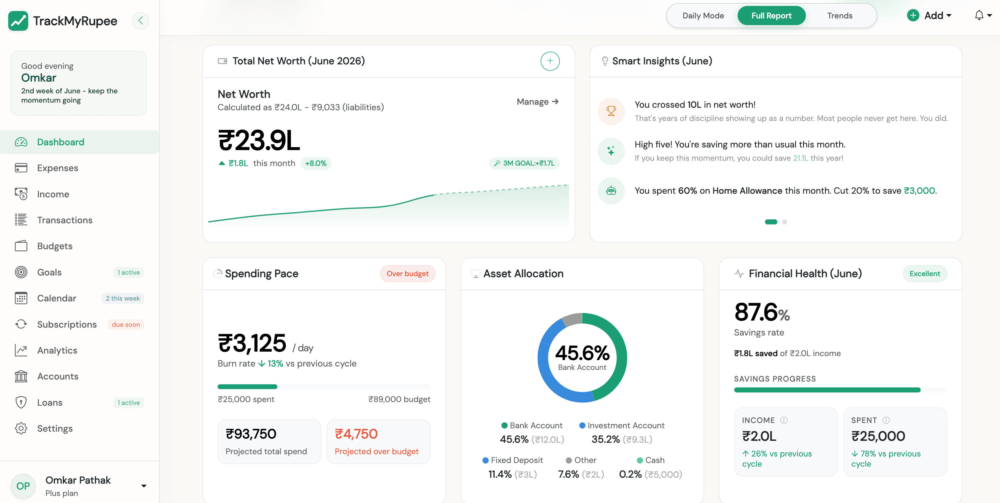

# TrackMyRupee
## The Privacy-First Personal Finance Dashboard for Professionals

**TrackMyRupee** is a premium, privacy-focused personal finance dashboard designed for individuals who want to take full control of their financial story, without compromising their data.

Unlike traditional finance apps, TrackMyRupee **does not** read your SMS, **does not** require bank logins, and **never** sells your data. It is built on the principle of *manual precision*: you stay in the driver's seat of your wealth, and the app makes the manual part fast.

**[Try the Live App](https://trackmyrupee.com)** | **[View Demo](https://trackmyrupee.com/demo/)** | **[Read the Docs](https://docs.trackmyrupee.com)** | **[Star on GitHub](https://github.com/OmkarPathak/trackmyrupee)**

<div align="center">


</div>

---

## 💎 Why TrackMyRupee?

Stop being the product. Most "free" finance apps profit by selling your spending habits. TrackMyRupee is built differently:

- **🔒 Zero Surveillance**: No SMS reading. No bank scraping. Period.
- **⚡ Fast Manual Entry**: Type "zomato 450 yesterday upi" and the app fills in the amount, date, category and payment method for you.
- **🧭 Set Up Life Events in One Form**: TMR Flows turn "I took a loan" or "I started a new job" into every linked record you need.
- **📈 Comprehensive Net Worth**: Cash, bank accounts, investments, deposits, physical assets and loans in one unified view.
- **🎯 Goal-Slaying Engine**: Visual savings goals with progress tracking and celebratory confetti.
- **🌍 Global Ready**: Multi-currency support with live exchange rates and interfaces in English, Hindi and Marathi.
- **🛡️ Data Sovereignty**: Export your entire history anytime. Delete your account and all data with one click.



---

## Features

### ⚡ Fast Entry
*   **One-Line Composer**: Type an expense the way you would text a friend. Amounts, dates and payment methods are understood, and a voice option is available.
*   **Learns Your Habits**: It remembers the category, account and payment method you pick for each merchant, and offers your usual expenses as one-tap chips.
*   **Safety Nets**: A second look at unusually large amounts, a 10-minute undo, and double-tap protection so one expense is never saved twice.
*   **Bulk Import**: Import months of data from Excel.
*   **Smart Category Prediction**: Personalised learning and rule-based matching, with optional Gemini AI for harder cases.

### 🧭 TMR Flows
*   **11 Guided Flows**: Loan, credit card, salary, rent or bill, insurance, SIP or RD, fixed deposit, PPF/EPF/NPS, savings goal, car and gold.
*   **Review Before Anything Is Saved**: Every Flow shows exactly what it will create, then commits it all at once or not at all.
*   **Backfill the Past**: Optionally create the entries you missed since a start date in the past.
*   **Your Setup Progress**: See which Flows you have already set up and what is left.

### 💰 Wealth Management
*   **Account Ledger**: Detailed transaction history for every bank account, wallet, deposit and card.
*   **Internal Transfers**: Move money between accounts with balanced reconciliations.
*   **Net Worth Tracking**: Watch your total wealth grow with automated balance aggregation and a history chart.
*   **Holdings**: Track mutual fund and other investment holdings alongside your accounts.
*   **Capital Events**: Record one-off big payments (a down payment, a medical bill) so they do not distort your monthly averages and budgets, while still counting in your net worth.

### 🔎 Filters and Search
*   **One Filter Bar Everywhere**: The same time period menu, filter chips and sorting on every list page.
*   **Salary-Cycle Aware**: "This month" follows your pay day, not the calendar month.
*   **Page Finder**: Press Cmd+K (Ctrl+K on Windows and Linux) to jump to any page.
*   **Shareable Views**: Filters live in the URL, so you can bookmark a view.

### 📉 Recurring and Planning
*   **Recurring Transactions**: Never miss a rent payment or SIP with smart reminders and automatic posting.
*   **Calendar**: See bills, income and spending on a colour-coded monthly calendar.
*   **Smart Budgeting**: Set monthly limits per category and get notified at 80 percent and 100 percent.

### 🎯 Savings Goals
*   **Visual Progress**: Progress bars, a per-cycle target, and a savings trend chart.
*   **Gamified Success**: Confetti celebrations when you reach your targets.
*   **Auto-Refunding**: Delete a goal and its contributions go back to their source accounts.

### 📊 Insights and Analytics
*   **Visual Dashboards**: Deep dives into your spending by category and account, with a financial health score.
*   **Month-over-Month Trends**: Compare your financial habits over time.
*   **Year in Review**: A wrap-up of your annual spending story.
*   **Automated Reports**: Monthly financial summaries delivered to your inbox.

### 🏦 Loan Management
*   **EMI Calculator**: Preview your monthly EMI before taking a loan.
*   **Multiple Loans**: Track home, car, personal, education and business loans.
*   **Floating Interest Rates**: Update rates as loan terms change.
*   **Amortization Schedule**: Visual breakdown of principal versus interest for each payment.
*   **Repayment Logging**: Track actual payments and monitor remaining principal.

### 🔐 Bank-Grade Accounting
*   **Double-Entry Ledger**: Every transaction is recorded on both sides for data integrity.
*   **Reconciliation Tools**: Maintenance commands detect and report discrepancies.

### 📱 Everywhere You Are
*   **Installable PWA**: Add it to your home screen, with push reminders for daily spends.
*   **Native Wrappers**: A Capacitor project in `mobile/` wraps the web app for iOS and Android (see `BUILD_MOBILE.md`).

---

## 📖 Documentation

Step-by-step guides with screenshots for every feature live at **[docs.trackmyrupee.com](https://docs.trackmyrupee.com)**. The source is in `guide-src/` and is built with MkDocs Material.

To preview the docs locally:

```bash
pip install -r requirements-docs.txt
mkdocs serve
```

---

## 🚀 Quick Start

### Self-Hosted (Docker)
Run your own private instance. The full guide is in the [self-hosting docs](https://docs.trackmyrupee.com/21-self-hosting/).
```bash
git clone https://github.com/OmkarPathak/trackmyrupee
cd trackmyrupee

# Create a .env file with at least SECRET_KEY and DEBUG=False
# (see the self-hosting docs for the full list of settings)

# The compose file expects an existing external network
docker network create proxy-network

docker-compose up
```
Visit: `http://localhost:8000`

`docker-compose.yml` pulls the published `omkarpathak27/trackmyrupee` image and mounts the repository folder at `/app`. On start it runs migrations, collects static files and compiles translations.

### Manual Setup (Django)
```bash
# Install dependencies (Python 3.11 recommended, the Docker image uses it)
pip install -r requirements.txt

# Create a .env file with at least:
#   SECRET_KEY='any-long-random-string'
#   DEBUG=True
#   USE_SQLITE=True

# Run migrations & setup
python manage.py migrate
python manage.py createsuperuser

# Optional: a read-only demo account with sample data
python manage.py setup_demo_user

# Start the dashboard
python manage.py runserver
```

---

## 🛠️ Built With
*   **Backend**: Python 3, Django 4.2
*   **Database**: PostgreSQL / SQLite
*   **Frontend**: Server-rendered templates with HTMX, Alpine.js, Bootstrap 5 and Chart.js (all self-hosted)
*   **Mobile**: Installable PWA and Capacitor wrappers
*   **DevOps**: Docker, GitHub Actions, Sentry

---

## 🤝 Contributing
See [CONTRIBUTING.md](CONTRIBUTING.md) for how to set up a development environment and send a pull request.

---

## 📬 Contact & Support
TrackMyRupee is an open-source project by **[Omkar Pathak](https://omkarpathak.in)**.
Found a bug? Have a feature request? Feel free to **[Open an Issue](https://github.com/OmkarPathak/trackmyrupee/issues)**.

---

## 📜 License
Licensed under the **MIT License**. Your money, your data, your code.
