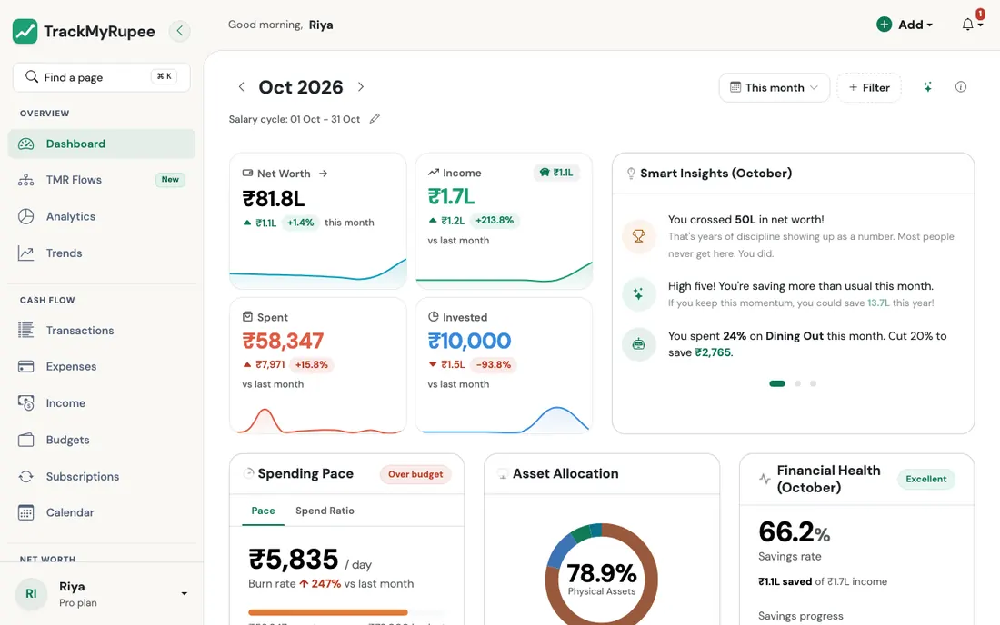
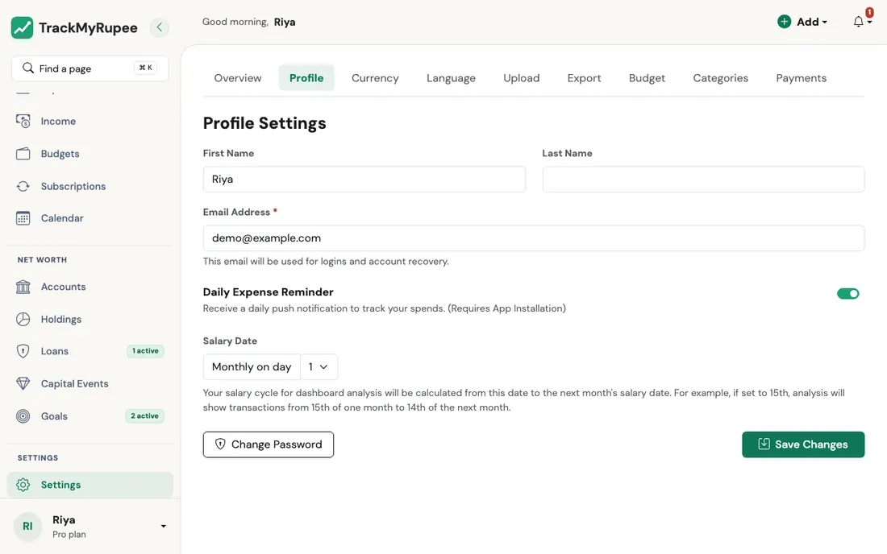
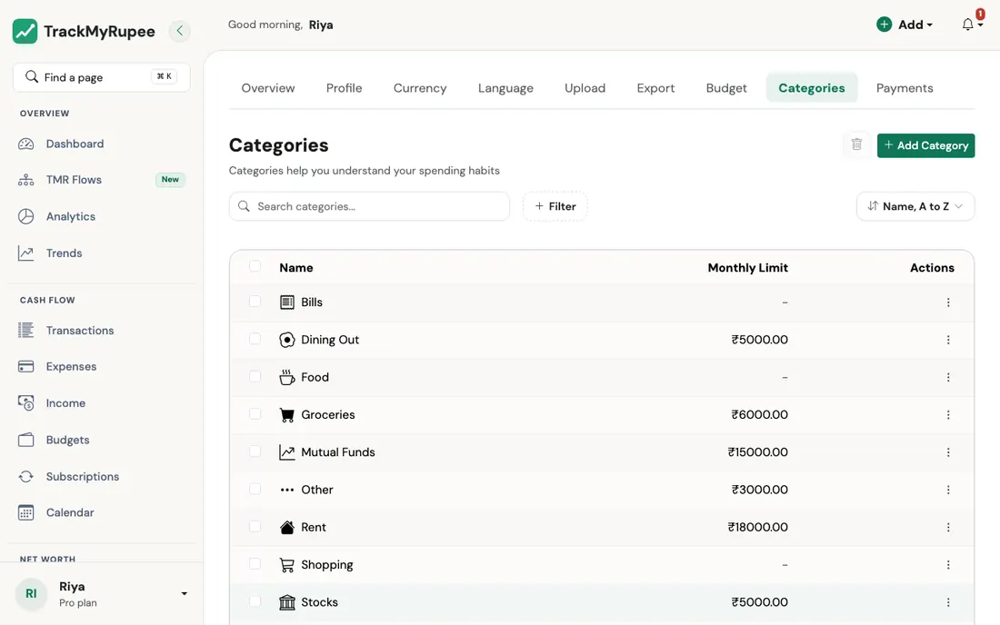

# Getting Started

Set up your accounts, configure your salary cycle, and establish your financial baseline in TrackMyRupee.

---

## 1. First Login

When you open TrackMyRupee for the first time, you can choose between entering demo mode or creating a real account.

{ loading=lazy }

If you enter demo mode, you will see a banner at the top: "You are in Demo Mode. This is a demo with sample data for illustration." The banner has links to create a free account or exit. Demo data is temporary and does not save any changes.

---

## 2. Setting the Salary Cycle Start Date

Find the pencil icon next to "Salary cycle: 01 Aug - 31 Aug" on the Dashboard. Click it and enter the day of the month when your salary typically arrives (for example, 28).

{ loading=lazy }

Do this before logging any transactions. Every budget period calculation depends on this date matching how money actually flows into your account.

---

## 3. Creating Your First Account

Navigate to **Sidebar → Accounts → Add** on desktop, or **Bottom tab → Accounts → Add** on mobile.

{ loading=lazy }

The form works as a two-step wizard:

1. **Account Basics**: Enter Account Name, Account Type, Currency, and Initial Balance.
2. **Type-specific step**: Fill in fields that apply to your account type.

Use these account types as a guide:

- **Cash Wallet** for physical cash you carry
- **Savings Account** or **Salary Account** for your bank accounts
- **Demat Account** or **Mutual Funds** for investment accounts

---

## 4. Setting an Accurate Opening Balance

The opening balance you enter becomes the base that every future net worth calculation builds on. Enter the exact real-world balance of that account on the day you set it up.

If you set an incorrect opening balance and correct it later, all historical net worth data points will change.

!!! tip "Create all accounts before your first transaction"
    Add every real-world account you own, including a Cash Wallet for physical cash, before logging your first transaction. Every expense and income entry must be attached to an account. Having them all set up from the start means your Day 1 net worth is accurate rather than artificially low.

---

## 5. Default Categories

When you sign up, three default expense categories are created automatically: Food, Shopping, and Bills. You can edit, rename, or add more categories at any time in **Settings → Categories**.

{ loading=lazy }

!!! example "Real-world use case"
    Ananya joins TrackMyRupee for the first time. She has an HDFC Salary Account (balance: Rs. 42,000), an SBI Savings Account (balance: Rs. 1,15,000), and Rs. 3,500 cash in her wallet. She creates all three accounts before logging a single transaction, using Salary Account for HDFC, Savings Account for SBI, and Cash Wallet for physical cash. Her Day 1 net worth shows Rs. 1,60,500, which is an accurate baseline she can track against going forward.

---

## 6. A Faster Way to Set Everything Up

Once your first account exists, the quickest way to cover the rest of your money is **TMR Flows**, found in the sidebar. Instead of filling separate forms for your salary, rent, loans, cards, and investments, you answer one short form per life event, such as "I started a new job" or "I took a loan", and everything connected to it is created for you.

{ loading=lazy }

A good first four are, in this order:

1. [I started a new job](../13-tmr-flows/income-and-bills.md#i-started-a-new-job), which also sets your salary cycle from step 2 above
2. [I pay rent](../13-tmr-flows/income-and-bills.md#i-pay-rent)
3. [I took a loan](../13-tmr-flows/debt.md#i-took-a-loan), if you have one
4. [I got a credit card](../13-tmr-flows/debt.md#i-got-a-credit-card), if you have one

See [TMR Flows](../13-tmr-flows/index.md) for the full tour.

---

## Related Links
- [Philosophy](../00-philosophy.md)
- [Accounts and Net Worth](../02-accounts/index.md)
- [Adding Expenses](../03-transactions-expenses/index.md)
