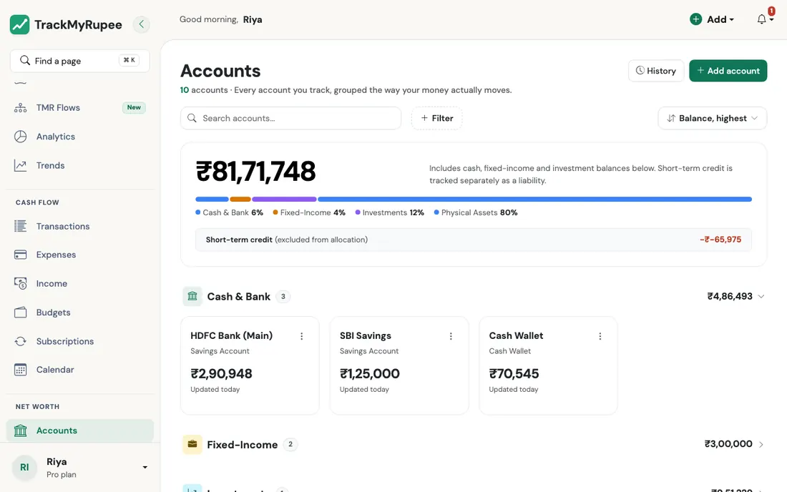
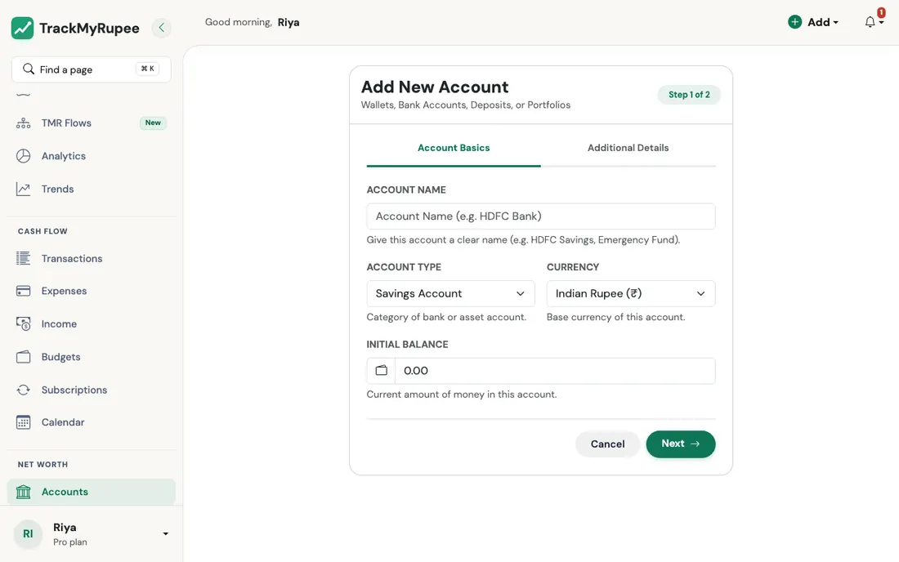
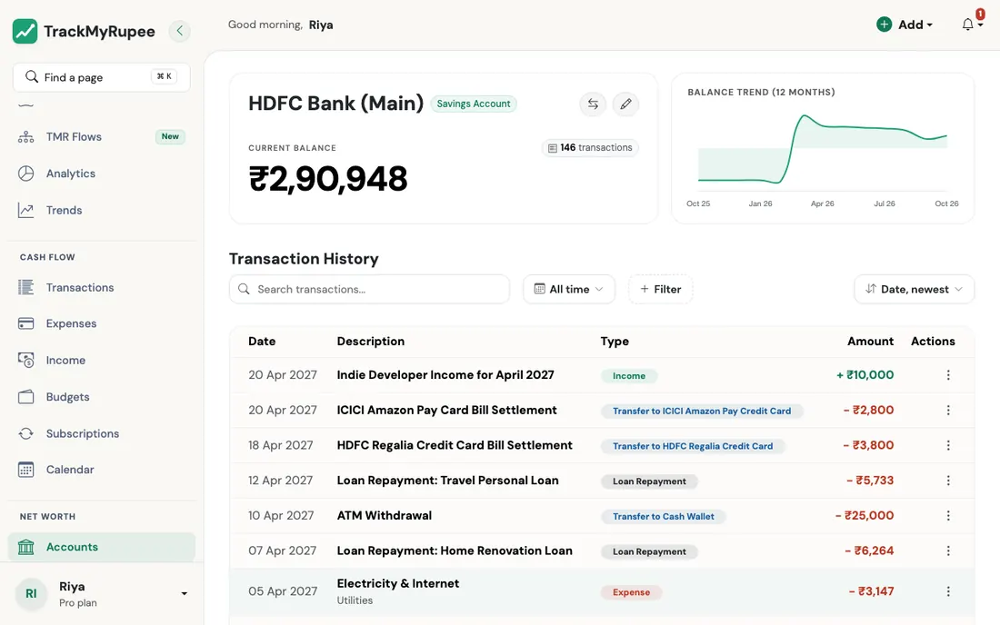

title: Accounts and Net Worth
description: Understand account types, net worth calculation, and how recurring deposits and valuations are handled in TrackMyRupee.
keywords: TrackMyRupee accounts, net worth calculation, recurring deposit, account types, holdings

# Accounts and Net Worth

Manage all your assets and liabilities in one place and track your overall net worth accurately.

---

## 1. Opening the Accounts Page

Navigate to **Sidebar → Accounts** on desktop, or tap the **Accounts** tab in the bottom navigation on mobile. The page groups your accounts into asset categories such as Cash and Bank, Fixed-Income, and Investments.

{ loading=lazy }

The total card at the top adds up the accounts that match your current filter, in your own currency. Each account is valued the way Net Worth values it (market value for funds, accrued interest for deposits, outstanding principal for loans), accounts in another currency are converted once, and what you owe on **credit cards and loans counts as negative**. Each row still shows the account's balance in its own currency, and the coloured bar splits only what you hold, so cards and loans appear as their own "owed" lines under it.

!!! info "Accounts total vs. Net Worth"
    With no filter, the accounts total and the Dashboard **Net Worth** card agree. Net Worth adds two things the accounts list cannot show: money you have set aside in [Goals](../12-goals/index.md) (it is still yours) and any active loan you track that is not linked to a loan account.

---

## 2. Adding an Account

Click **+ Add** next to Accounts in the sidebar on desktop, or tap **+ Add** on the Accounts page on mobile.

{ loading=lazy }

The form is a two-step wizard:

1. **Account Basics**: Enter Account Name, Account Type, Currency, and Initial Balance.
2. **Type-specific fields**: Fill in details that apply to your account type. For example, Fixed Deposits show deposit terms and maturity date fields. Credit Cards show a credit limit field.

Click **Save** when done.

Account names must be unique among your active accounts (capital letters do not matter, so "HDFC" and "hdfc" clash). A credit limit and a deposit principal cannot be negative, and an interest rate must be between 0 and 100.

!!! info "How many accounts you can have"
    Free allows 2 active accounts, Plus allows 10, and Pro is unlimited. Deleted accounts do not count. If you go over a limit (for example after a downgrade), your **oldest** accounts stay open and the newer ones are locked until you upgrade or delete some: a locked account cannot be opened, edited or used in a transfer. Pinning or searching never changes which accounts are locked.

!!! info "Balances are stored in the account's currency"
    An expense or income in another currency is converted into the account's currency when it is posted. Because of that, the **currency of an account is locked** as soon as it has any transaction (expense, income, transfer, goal contribution, loan repayment or capital event). Change it only while the account is unused.

## 3. Account Types Reference

| Type | Use for |
|---|---|
| Cash Wallet | Physical cash you carry |
| Savings Account | Regular bank savings account |
| Salary Account | Bank account where your salary lands |
| Fixed Deposit | FD or RD with interest accrual |
| Mutual Funds | Mutual fund or SIP investment account |
| Demat Account | Stock trading and brokerage account |
| NPS / PF | Provident fund or pension account |
| Credit Card | Credit card (tracked as a liability) |
| Loan Account | Linked to a loan for repayment tracking |
| Physical Asset | Real estate, vehicle, or other asset |
| Insurance | Life or endowment policy |

!!! info "Note on Recurring Deposits (RD)"
    RD valuation is not treated like a single lump-sum FD from day one. Each installment accrues from its own deposit date, and only installments that were actually posted are counted. If a month is skipped, that installment is not assumed automatically.

!!! info "Note on Credit Card, BNPL, and Overdraft Billing Dates"
    For revolving credit accounts (Credit Card, BNPL, Overdraft), you can set an optional **Billing Day of Month** (1–31). TrackMyRupee computes the next upcoming billing date, displays a badge on your account list, and sends a **3-day advance reminder**.
    - **In-App Notification Panel**: Delivered to all active users.
    - **WebPush Notifications**: Delivered to all active users who have enabled browser push notifications.
    - **Email Digest**: Included in daily financial digest emails for Plus and Pro tier subscribers.

---

## 4. Editing Account Details and Balance

Click any account row to open its detail page. Use the pencil (edit) icon to update the Account Name, Initial Balance, or any type-specific fields.

**Deleting an account does not erase anything.** It marks the account inactive: it disappears from the list, from transaction pickers and from net worth, but every expense, income, transfer and other row you posted to it stays in place, and you can still open its history. To see deleted accounts, open the **Inactive** view on the Accounts page.

Use **Restore** on an inactive account to bring it back. Restoring is refused if you are already at your plan's account limit, or if another active account now has the same name (rename one of them first).

!!! warning "Editing the balance"
    Editing the balance by hand treats the number you enter as the truth and records the difference as an adjustment. It does not create an income or expense, so your reports do not change.

### Transfers between accounts

Moving money between your own accounts is covered in [Transfers](../06-transfers/index.md). Editing or deleting a transfer puts the money back exactly as it was before applying the change.

---

## 5. Reading Account Transaction History

Click any account row to open its detail page. Below the balance and its trend chart is the account's full **Transaction History**: every expense, income, transfer in or out, goal contribution, loan repayment and capital event posted to that account.

{ loading=lazy }

The table looks and behaves like the [All Transactions](../03-transactions-expenses/index.md) page:

| Column | What it shows |
|---|---|
| **Date** | When it happened |
| **Type** | A coloured pill: Expense, Income, Transfer, Savings, Loan Repayment or Capital Event |
| **Description** | Your note (long notes are cut short; hover to read all of it) |
| **Category/Source** | The expense category, income source, the other account of a transfer ("To SBI Savings", "From HDFC"), the goal, the loan, or the capital event type |
| **Amount** | Green with **+** when money came into this account, red with **-** when it left. A foreign-currency row also shows its value in your own currency underneath. A capital event you excluded from net worth never moved the balance, so it is shown in grey with no sign |
| **Actions** | Edit or delete the row (or open its goal or loan). After saving you land back on this page |

Click the **Amount** heading to sort by amount, and again to flip the order. On a phone the rows become cards grouped by day.

Under the title, a line sums up what you are looking at: the number of transactions, the money **in**, the money **out** and the **net**. The totals are in the account's own currency and follow your filters. The count in the card at the top is always the account's total, whatever you filter.

### Searching and filtering

The same toolbar as the other list pages sits above the table:

- **Search** matches descriptions, categories, income sources, goal and loan names.
- **Time range** (All time by default), **Sort**, and **Filter** with **Transaction Type**, **Category** and **Amount**. Picking a category shows only expenses and income, because transfers, savings and loan rows have none.
- Each active filter appears as a chip you can clear on its own, or use **Clear all**.

## 6. How Net Worth Is Calculated

**Net worth = what you hold - what you owe.** The **Net Worth** tile on the Dashboard sums your active accounts, each valued by its type, and subtracts liabilities. Everything is converted to your currency at the latest exchange rate.

- **Cash and Bank accounts**: ledger balance
- **Fixed Deposits and other deposit accounts**: principal plus accrued interest
- **Mutual Funds and Demat**: latest value of each holding, plus any cash in the account that is not invested
- **Physical Assets**: latest valuation, or the purchase cost if you have not valued it yet
- **Insurance**: latest surrender value, or zero if none is recorded (the premium you paid is never counted)
- **Credit Cards**: the balance owed is subtracted. A card in credit (you overpaid) adds to your net worth instead
- **Loans**: the outstanding principal, which is the amount borrowed minus the principal you repaid, minus prepayments and down payments, minus any principal you had already paid before you started tracking. A loan linked to a loan account is counted once through that account, and an active loan with no loan account is subtracted directly. A fully paid-off loan counts as zero
- **Goals**: money moved into a goal leaves your account but is still yours, so it is added back and net worth does not drop when you save towards a goal

Inactive (deleted) accounts are left out.

### Change this month and the trend

The change shown on the Net Worth tile is what you **saved this month**: income minus spending, using the same definition as the savings rate. Repaying loan principal is not spending (your cash goes down and your debt goes down by the same amount), only the interest is. Capital events count only when they are not excluded from averages.

The sparkline walks back from today's figure by each earlier month's savings, so it is an **estimate**. It does not know about market price changes, revaluations or money moved without being recorded, so use it for direction rather than for exact past values. A snapshot of your net worth is also saved each day for the record.

!!! example "Real-world use case"
    Before deciding whether to make a Rs. 60,000 laptop purchase, Rahul opens Accounts to check his real net worth across his HDFC Salary Account, SBI Savings Account, and Cash Wallet in one place rather than opening three separate banking apps. The Filtered Total Balance shows Rs. 1,92,000 across all three, confirming he can absorb the purchase without going below his Rs. 1,00,000 emergency reserve.

---

## Related Links
- [Holdings and Mutual Funds Portfolio](holdings.md)
- [Accrued vs Invested Balance View](accrued-vs-invested.md)
- [Getting Started](../01-getting-started/index.md)
- [Transfers](../06-transfers/index.md)
- [Analytics, Trends and Financial Health](../11-analytics-and-health/index.md)
