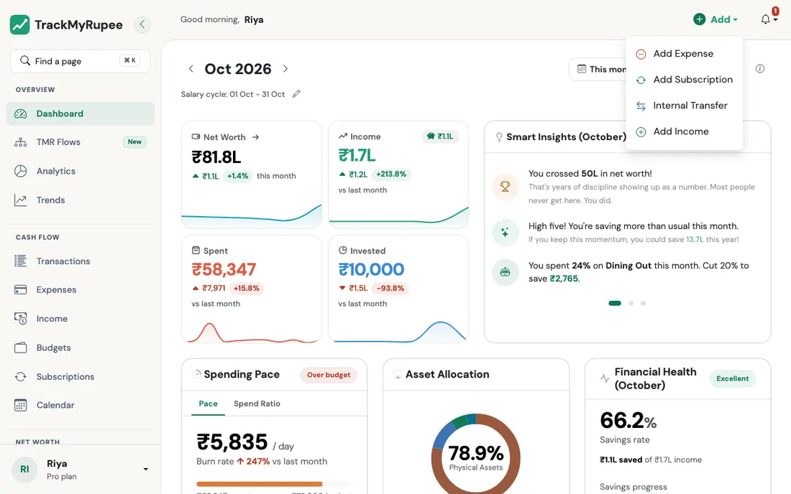
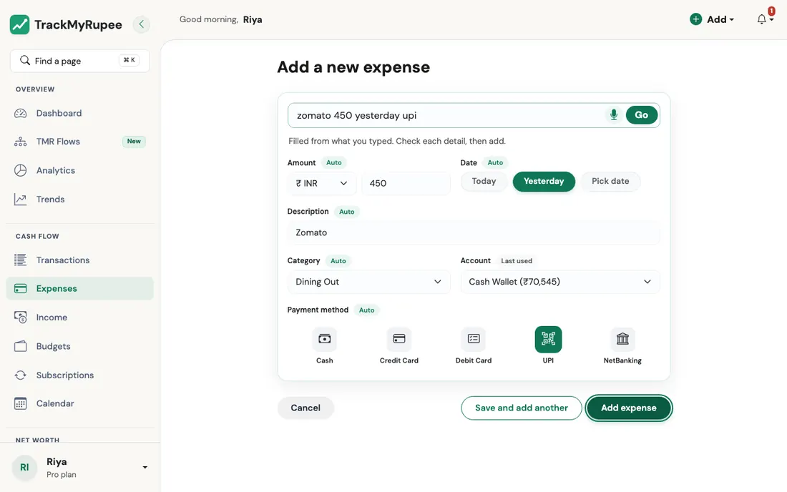
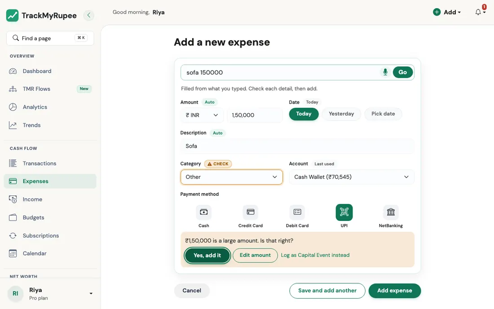
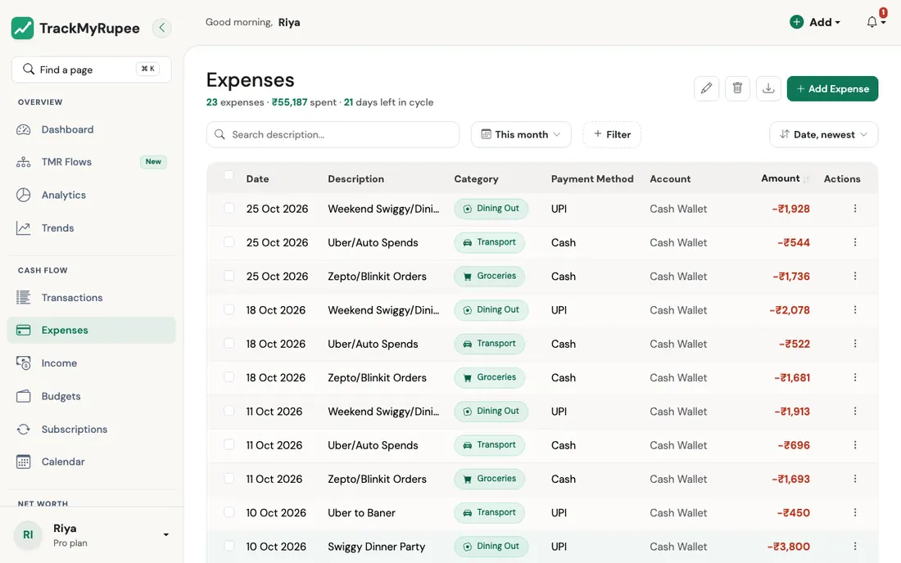

# Adding Expenses

Log every outgoing payment so your budget, analytics, and net worth stay accurate.

---

## 1. Opening the Expense Form

{ loading=lazy }

- **Desktop**: Click **Add** in the top navbar, then select **Add Expense**.
- **Mobile**: Tap the **+** button in the bottom tab bar, then tap **Add Expense** from the sheet that appears.

You can also use the **+ Add** shortcut next to **Expenses** in the sidebar on desktop.

The page that opens is called **Add a new expense**, and it starts with a single line to type in.

---

## 2. Type It Like You Would Text a Friend

You do not need to open a form and tick through boxes. The box at the top says **What did you spend on?** with an example, *swiggy 320*. Type the way you would message a friend, press **Enter** (or tap **Go**), and TrackMyRupee reads your sentence and fills in the form for you.

{ loading=lazy }

Here are a few lines it understands:

| You type | What it picks up |
|---|---|
| `swiggy 320` | Amount 320, description Swiggy, and a category it guesses from your history |
| `uber to airport 450 upi yesterday` | Amount 450, UPI, yesterday's date, description "Uber to airport" |
| `groceries 1,850 hdfc cc` | Amount 1,850, your HDFC credit card account, Credit Card as the payment method |
| `rent 1.5k cash 3 oct` | Amount 1,500, Cash, 3 October |
| `laptop bag 2 lakh` | Amount 2,00,000 (it understands k, lakh, and crore, and will ask you to confirm a big amount, see [Safety Nets](#4-safety-nets)) |
| `coffee 250 gpay` | Amount 250, UPI (GPay counts as UPI), description Coffee |

It understands:

- **Amounts** written as `450`, `1,250`, `1.5k`, `2 lakh` or `1 crore`, with or without ₹, Rs, or a currency word
- **Dates** such as *today*, *yesterday*, *day before yesterday*, *3 oct*, *3rd october*, and *03/10*. Common Hindi and Marathi words for yesterday and today work too.
- **Payment methods** such as UPI, GPay, PhonePe, Paytm, credit card, debit card, cash, and net banking
- **Account names**, when you mention the bank or card by name
- **Hindi and Marathi**, including Devanagari numerals

Anything it does not recognise as one of those becomes the **description**.

!!! example "Think of it like a good waiter"
    A good waiter does not hand you a form listing every dish. You say "the usual, but less spicy", and he writes it down correctly. The composer does the same: you give it the short version, and it fills in the long version for you to approve.

### Your usual

Under the box, you will often see a row of chips labelled **Your usual**, such as `swiggy 320` or `auto 80`. These are expenses you have repeated at least twice in the last two months, with the same description and amount. Tap one and the form fills in at once, including the category, account, and payment method you used last time. It is the fastest way to log your daily chai or your regular auto ride.

### Speak instead of type

The small microphone button next to **Go** lets you say the expense out loud. Allow microphone access when your browser asks. If voice is not available in your app view, use the microphone on your phone keyboard to dictate into the same box instead.

---

## 3. Check, Then Add

After you press Enter, the form opens below with everything filled in, and a line that says *"Filled from what you typed. Check each detail, then add."* Nothing is saved yet. You can change anything.

Look at the small tags next to each field:

- **Auto** means this field was filled in from what you typed.
- **Check** (in amber) means TrackMyRupee was not sure. The most common case is a **Category** it could not guess, which is left on *Select category* for you to choose.
- **Last used** on the account means it picked the account you used most recently.

The fields are:

1. **Amount** and its currency
2. **Date**: tap **Today** or **Yesterday**, or **Pick date** for another day. Future dates are not allowed.
3. **Description**
4. **Category**: you can also choose **+ Create category** if the one you need does not exist yet
5. **Account**: the account the money came from
6. **Payment method**: tap one of Cash, Credit Card, Debit Card, UPI, or NetBanking

Then choose one of two buttons:

- **Add expense** saves it.
- **Save and add another** saves it and clears the form, which is ideal when you are logging a pile of receipts.

If you would rather skip the typing completely, tap **Enter details manually** under the box and fill the fields yourself.

### It gets smarter as you use it

Each time you save, TrackMyRupee remembers what you picked for that kind of expense. The next time you type *swiggy*, it will fill in the same category, account, and payment method you used last time, so the "Check" tag shows up less and less. If you change your mind later, just pick differently once, and it will follow your latest choice.

---

## 4. Safety Nets

### Big amounts get a second look

If an amount is large (₹1,00,000 or more in rupees), you will see *"... is a large amount. Is that right?"* with three options:

{ loading=lazy }

- **Yes, add it**
- **Edit amount**
- **Log as Capital Event instead**, for one-off big payments like a laptop or an advance. See [Capital Events](../09-capital-events/index.md).

This catches the classic extra zero, and it nudges big one-off payments toward the place where they will not wreck your monthly budget.

### Undo for ten minutes

After you add an expense, a message appears that says **Added** followed by a short summary, with an **Undo** button. Tap it within **ten minutes** and the expense is removed. After that, delete it from the Expenses list instead.

### Double taps are harmless

If you tap **Add expense** twice, or your connection hiccups and you retry, the expense is saved only once.

### Monthly limit on the Free plan

The Free plan has a monthly cap on the number of expenses. If you reach it, the composer tells you and offers an **Upgrade** button rather than failing silently. The cap counts expenses dated in the current month, and it applies to every way an expense can be created: the composer, an upload, and converting a Capital Event into an expense. Expenses dated in earlier months do not count towards it.

---

## 5. Filling the Form Manually

If you prefer the classic way, use **Enter details manually**, then fill in:

1. **Amount** (required): The amount you spent.
2. **Category** (required): The spending category, such as Food, Transport, or Bills.
3. **Description** (optional): A short note about what you spent on.
4. **Account**: The account the money came from. **Required.** It is pre-selected for you (the one you used last, or your first account). If you clear it, the form shows "Select the account this was paid from" under the field and nothing is saved, so every expense is always taken out of an account. If you have no account yet, add one first from **Accounts**. Expenses saved before this rule that have no account keep working; pick an account when you next edit one and its balance is charged then.
5. **Date**: Defaults to today.
6. **Payment Method**: Tap one of Cash, Credit Card, Debit Card, UPI, or NetBanking.

Click **Add expense** when you are done.

---

## 6. Where the Expense Appears

After saving, the expense appears in several places at once:

{ loading=lazy }

- The **Expenses** list at `/expenses/`
- The **Transactions** list at `/transactions/`
- The **Dashboard** Spent tile for the current period
- The **Budget** bar for the category you selected

---

## 7. Editing or Deleting an Expense

Find the expense in the Expenses list and click or tap the row to open it. Use the edit icon to open the form and change any field. Click **Save** to apply the changes.

To delete, use the delete (trash) icon on the expense detail screen. A confirmation prompt will appear before the record is removed.

Rules the form enforces, on every screen:

- The **amount** must be greater than zero.
- The **date** cannot be in the future.
- The **account** must be one of your own active accounts.

### What happens to your account balance

Your account balances follow your expenses automatically, so you never adjust them by hand.

| You do this | The account balance |
|---|---|
| Add an expense | Goes down by the amount (a credit card owes more) |
| Edit the amount | Changes only by the difference |
| Move it to another account | The old account gets the money back and the new one is charged |
| Delete it (or **Undo** it) | Gets the money back |
| Leave the account empty | Nothing changes |

### Spending in another currency

Pick a different currency in the form and TrackMyRupee converts it to your own currency at the rate of the day you save it. Your totals, budgets, and charts use the converted amount. If the account is in yet another currency, it is charged in that account's currency. The Expenses list shows the converted amount with the original in brackets beneath it, and the CSV export includes the rate and the converted amount.

---

## 8. Managing Your Expenses

The **Expenses** page lists your expenses, 20 to a page. It opens on the current period.

- **Search** looks in the description.
- **Filters** narrow by category, payment method, account, amount, or recurring. See [Search and Filters](../14-filters-and-search/index.md).
- **Sort** by date or amount, highest or lowest first.
- The line under the page title shows the **count and total** of whatever you are looking at.

### Change or delete many at once

Tick the expenses you want, then use the edit or delete icon at the top.

- **Bulk edit** changes the **category** and/or **payment method** of all selected expenses. Amounts, dates, and accounts are not changed in bulk, and account balances stay as they are.
- **Bulk delete** removes them and gives every amount back to its account.

You can only pick from your own categories and the five payment methods.

### Turn an expense into a Capital Event

If you logged something big as an ordinary expense, open its menu and choose **Convert to Capital Event** (you will be asked to confirm). The expense is removed and an equal Capital Event is created for the same date, account, and amount, so the money is charged once, and your monthly budget no longer includes it. See [Capital Events](../09-capital-events/index.md).

### Export to CSV

On **Plus** and **Pro**, the export button downloads exactly what the list is showing: the same period, search, filters, and sort. The file has the date, description, amount, currency, exchange rate, amount in your currency, category, payment method, and account. On the Free plan the button takes you to the pricing page.

!!! example "Real-world use case"
    After a Swiggy delivery arrives, Meera opens **Add Expense**, types `swiggy dinner 450 upi`, and presses Enter. The amount, UPI, and the Food category are filled in for her, because she has logged Swiggy before and the app remembered. She glances at the form, taps **Add expense**, and the whole thing takes about ten seconds.

    A moment later she notices the date should have been yesterday, since the order came last night. She taps **Undo** on the message that appeared, types the line again with the word *yesterday* added, and saves. Her Food budget bar on the Dashboard moves forward by exactly ₹450, and not by ₹900.

---

## Related Links
- [Adding Income](../04-transactions-income/index.md)
- [Budgets](../07-budgets/index.md)
- [Calendar](../10-calendar/index.md)
