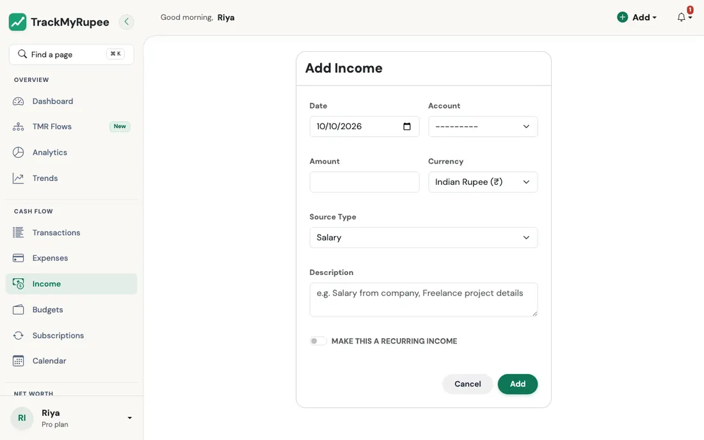
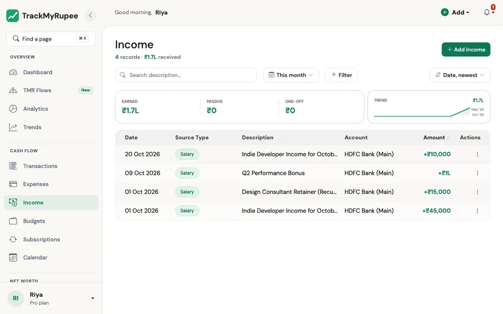

# Adding Income

Log every payment you receive so your savings rate, analytics, and net worth stay accurate.

---

## 1. Opening the Income Form

{ loading=lazy }

- **Desktop**: Click **Add** in the top navbar, then select **Add Income**.
- **Mobile**: Tap the **+** button in the bottom tab bar, then tap **Add Income**.

You can also navigate to **Sidebar → Income → Add** on desktop.

---

## 2. Choosing a Source Type

The **Source Type** field tells the app what kind of income this is. Choose the option that best describes the payment:

| Source Type | When to use it |
|---|---|
| Salary | Your regular monthly salary |
| Freelance / Consulting | Project fees or consulting payments |
| Business | Revenue from your own business |
| Investment Returns | Dividends, interest, or capital gains |
| Rental Income | Rent received from tenants |
| Cashback and Rewards | Credit card cashback or loyalty rewards |
| Refund / Reimbursement | Money returned to you (expense refund, bill reimbursement) |
| Other | Anything that does not fit the above |

!!! info "Why source type matters"
    The app separates your predictable income (Salary) from one-off receipts (Refund / Reimbursement) when calculating your savings rate. Cashback and Rewards and Refund / Reimbursement types are excluded from the savings rate denominator so they do not inflate your rate artificially.

---

## 3. Filling the Form

Complete the following fields:

1. **Date**: When the money arrived.
2. **Account** (optional): Which account the money landed in. Leave it empty and the income is recorded without changing any balance.
3. **Amount**: The amount received.
4. **Currency**: Defaults to your profile currency.
5. **Source Type**: Select from the list above.
6. **Description** (optional): A short note, such as the client name or invoice number.

If this income repeats, tick **Make this a recurring income** and choose the **Frequency** (it is required once the box is ticked). This creates a subscription that auto-posts the income going forward without any manual entry. The entry you are saving counts as the first one, so it is not posted twice.

!!! note "One schedule per source type"
    TrackMyRupee keeps a single active recurring schedule for each source type. If you tick the box again for a source type that already has one (for example when your retainer goes up), the existing schedule is **updated** with the new amount, frequency, and start date instead of a second one being created.

The form checks that:

- the **amount** is greater than zero, and
- the **date** is not in the future.

Click **Save** when done.

---

## 4. Where the Income Appears

After saving, the income entry appears in:

{ loading=lazy }

- The **Income** list at `/income/list/`, newest first
- The **Dashboard** Income tile for the current period
- The **Analytics** charts for year-to-date totals
- The balance of the account you chose, which goes **up** by the amount

### The Income page

The page opens on the current period and shows three totals for whatever you are looking at, based on the three kinds of income:

| Total | Source types it adds up |
|---|---|
| **Earned** | Salary, Freelance / Consulting, Business |
| **Passive** | Investment Returns, Rental Income |
| **One-off** | Cashback and Rewards, Refund / Reimbursement, Other |

Next to the totals, a small chart shows your **Earned** income for the last six months, so you can see at a glance whether your regular income is steady. Passive and one-off income are not in that chart.

You can search the description, filter by source type, income group, account, or amount, and sort by date or amount. See [Search and Filters](../14-filters-and-search/index.md). Income in another currency is converted to your own currency at the rate of the day you save it, and the totals use the converted amounts.

---

## 5. Editing or Deleting an Income Entry

Find the entry in the Income list. Click or tap it to open the edit form. Change any field and click **Save** to apply the update. The account balance is corrected automatically: change the amount and it moves only by the difference, move the entry to another account and the money moves with it.

To delete, use the delete action on the income detail screen and confirm the prompt. The amount is taken back out of the account.

!!! example "Real-world use case"
    Vikram is a freelance designer. On the 1st he logs his Rs. 45,000 monthly retainer as Source Type: Freelance / Consulting and ticks Make this a recurring income with Monthly frequency, so it auto-posts every month. On the 20th he receives a one-off Rs. 10,000 project bonus and logs it manually as Freelance / Consulting without the recurring box ticked. Keeping them separate means his income list clearly shows the regular retainer versus the one-off bonus, and Analytics does not treat the bonus month as his new normal.

---

## Related Links
- [Adding Expenses](../03-transactions-expenses/index.md)
- [Recurring Transactions and Subscriptions](../05-transactions-recurring/index.md)
- [Analytics, Trends and Financial Health](../11-analytics-and-health/index.md)
