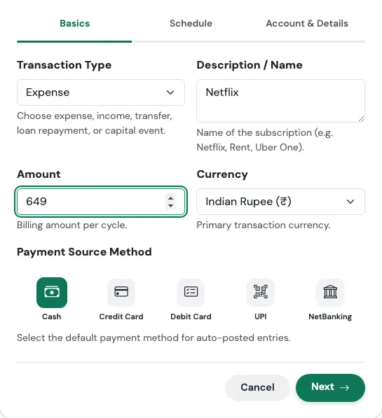
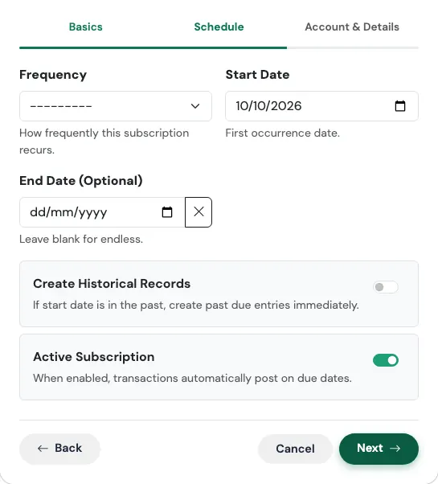
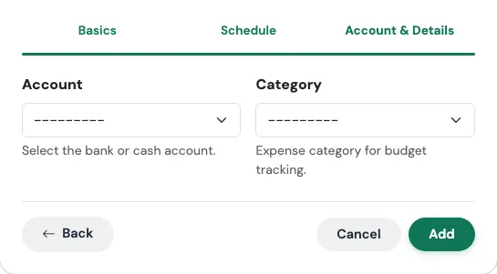
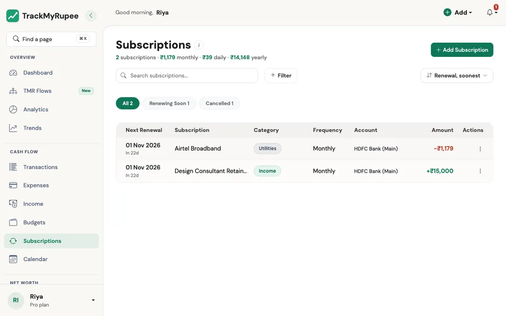

# Recurring Transactions and Subscriptions

Automate repeating transactions so you never miss a due date or forget to log a regular payment.

---

## 1. Opening the Subscription Form

- **Desktop**: Click **Add** in the top navbar, then select **Add Subscription**.
- **Mobile**: Tap the **+** button in the bottom tab bar, then tap **Add Subscription**.

You can also navigate to **Sidebar → Subscriptions → Add** on desktop.

---

!!! tip "Setting up a common one? Use a Flow"
    For the most common recurring items you can skip this form entirely. The [TMR Flows](../13-tmr-flows/index.md) page has ready-made shortcuts for **salary** ([I started a new job](../13-tmr-flows/income-and-bills.md#i-started-a-new-job)), **rent and bills** ([I pay rent](../13-tmr-flows/income-and-bills.md#i-pay-rent)), **insurance premiums**, **SIPs**, and **PPF / EPF / NPS contributions**. Each one asks only the questions that matter and creates the recurring entry, plus anything linked to it, in one go.

---

## 2. Filling the Three-Step Wizard

The form is organized into three steps:

### Step 1: Basics

{ loading=lazy width="545" }

- **Transaction Type**: Choose Expense for bills like streaming services or phone plans, Income for a monthly retainer, Transfer for a recurring investment or SIP, Loan Repayment for EMI payments, Capital Event for a repeating big one-off (such as an instalment on a purchase), or Insurance Premium for a policy.
- **Description**: The name of the subscription (for example, "Airtel Broadband" or "Netflix").
- **Amount**: The recurring amount. It must be greater than zero.
- **Currency**: Defaults to your profile currency.
- **Payment Method**: Cash, Credit Card, Debit Card, UPI, or NetBanking.

### Step 2: Schedule

{ loading=lazy width="545" }

- **Frequency**: How often the transaction repeats: **Daily, Weekly, Bi-Weekly (every 2 weeks), Monthly, Quarterly (every 3 months), Semi-Annually (every 6 months), or Yearly**.
- **Start Date**: The date of the first occurrence.
- **End Date** (optional): The date after which the subscription stops auto-posting. When the last occurrence is done, the subscription moves to **Cancelled** by itself.
- **Monthly Recurrence Rules** (Monthly only): Tick **Last Calendar Day of Month** to post on the 30th, 31st, or 28th/29th as the month requires, or **Last Working Day of Month** to post on the last weekday (Monday to Friday). Exactly one entry is posted each month. With either rule, the first entry lands on the first such day on or after your start date.
- **Create Historical Records** (optional): Only matters when your start date is in the past. When it is **off**, the subscription starts fresh from its next upcoming due date and leaves the past alone. When it is **on**, every missed occurrence between your start date and today is posted straight away, so your history is complete. Think of it as the difference between starting a new notebook today and copying down last quarter's entries first.

### Step 3: Account and Details

{ loading=lazy width="545" }

- **Account**: The account to debit (for expenses) or credit (for income). Loan repayments and insurance premiums need one.
- **From Account** and **To Account**: For transfers, the account the money leaves and the account it arrives in. They must be different.
- **Category** (expenses) or **Source** (income): Required for those types. A recurring income whose source matches one of the income source types (for example *Rental Income*) is posted with that source type; any other source is posted as *Other*.
- **Loan**: For loan repayments, pick the loan. The amount you enter is paid every time, and the app splits each payment into interest and principal for you. When the loan is paid off, the schedule ends by itself.
- **Active Subscription**: Untick it to pause the subscription (see below).

Click **Save Subscription** when done.

!!! note "No duplicates"
    You cannot have two active subscriptions with the same type, amount, currency, description, frequency, and start date. Change any one of those, or untick **Active** on one of them.

---

## 3. How Auto-Posting Works

On each scheduled date, the recurring engine automatically creates a new entry. You do not need to log it manually. The entry appears in your Transactions list, Expenses or Income list, and the relevant Budget bar, and your account balance moves just as if you had added it yourself. Posted entries are labelled with **(Recurring)** after the description.

The engine runs whenever you open your lists and straight after you save a subscription. If you were away for a while, it catches up on every missed date, once each. Running it twice never posts the same date twice, and it will not post an entry you already logged by hand for the same day, amount, and description.

A subscription **stops and turns inactive** by itself when:

- its end date has passed,
- a linked account has been deactivated, or
- (for loans) the loan is fully repaid, or the repayment is too small to cover the interest.

!!! tip "Editing a schedule does not rewrite the past"
    If you change a subscription's **Frequency** or **Start Date**, it restarts from its next upcoming date. Past dates are posted again only if you tick **Create Historical Records** while saving.

---

## 4. The "Renewing Soon" Section

The Subscriptions list at `/recurring/` shows a **Renewing Soon** section for every subscription that takes money out and is due within the next 30 days, soonest first. That includes expenses, transfers (such as SIPs), loan EMIs, insurance premiums, and capital events. Recurring **income** is not listed, because nothing is leaving your account. The sidebar also shows a due-soon badge when subscriptions are coming up.

Above the list you will see your **monthly, daily, and yearly cost**: every active expense, loan EMI, insurance premium, and capital event converted to a per-month and per-year figure (a quarterly bill of Rs. 1,200 counts as Rs. 400 a month). Income and transfers are not costs, so they are left out.

{ loading=lazy }

This gives you advance notice before a charge hits your account.

---

## 5. Pausing, Cancelling, and Deleting

- **Pause**: Open the subscription, untick **Active Subscription**, and save. It moves to the **Cancelled** section of the list and stops posting. Tick it again later to resume: it carries on from its next upcoming date and does not fill in the time it was paused, unless you tick **Create Historical Records** when you save.
- **Delete**: Use the delete action on the subscription and confirm. It stops posting from then on. Entries it has already posted stay in your records. When you delete a cost, the app shows how much a year you have just freed up.

---

## 6. Plan Limits

The number of **active** subscriptions depends on your plan: **Free 2, Plus 5, Pro unlimited**. Paused and deleted subscriptions do not count. Once you reach the limit, the Add button asks you to upgrade instead of opening the form.

If you ever have more active subscriptions than your plan allows (for example after a plan change), the oldest ones keep working and the newest ones are shown as **locked**: they do not post and cannot be edited until you upgrade or free up a slot.

---

!!! example "Real-world use case"
    Sneha sets up her Rs. 1,179 per month Airtel Broadband bill once as a recurring expense: Transaction Type Expense, Description Airtel Broadband, Amount 1179, Frequency Monthly, Payment Method NetBanking, Account HDFC Salary Account. Every month the app automatically posts the expense on the due date. She never has to remember to log it. The Renewing Soon section alerts her a few days ahead so a temporarily low balance does not catch her off guard.

---

## Related Links
- [Adding Expenses](../03-transactions-expenses/index.md)
- [Adding Income](../04-transactions-income/index.md)
- [Budgets](../07-budgets/index.md)
