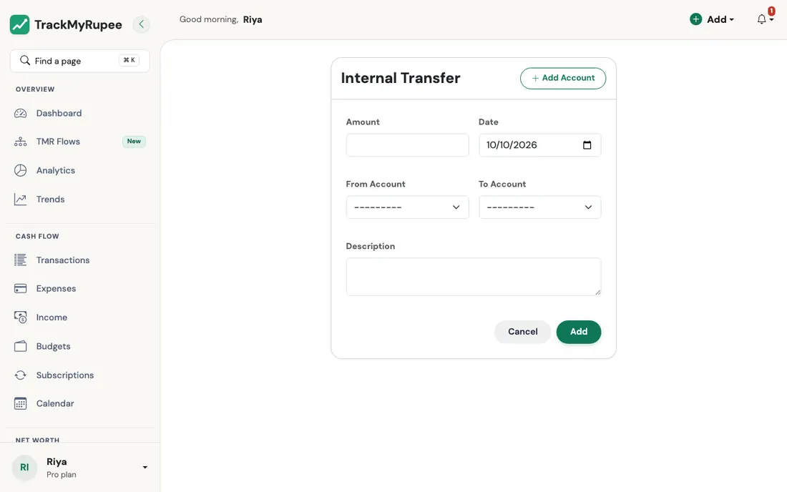
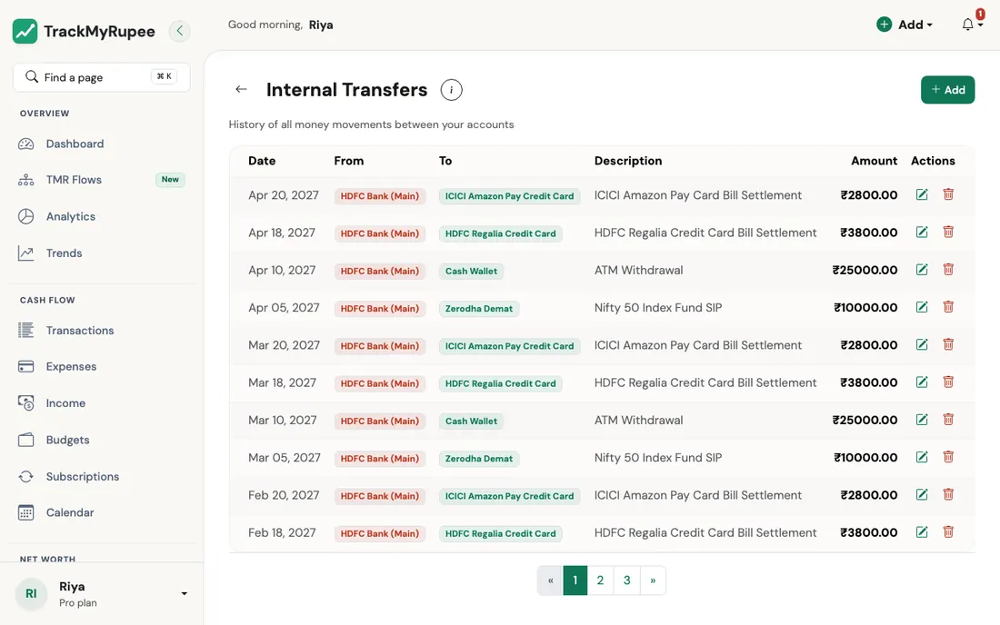

# Transfers

Move money between your own accounts without double-counting it as income or an expense.

---

## 1. Overview

An **Internal Transfer** moves money from one account you own to another. It does not change your net worth because the money stays within your own financial ecosystem. It is excluded from your income and expense totals in Analytics and the Dashboard.

Common uses include:

- Moving your month-end surplus from a salary account into a savings or investment account
- Sweeping idle cash from a savings account into a mutual fund account
- Moving physical cash into a bank account

---

## 2. Opening the Transfer Form

{ loading=lazy }

- **Desktop**: Click **Add** in the top navbar, then select **Internal Transfer**.
- **Mobile**: Tap the **+** button in the bottom tab bar, then tap **Internal Transfer**.

---

## 3. Filling the Form

Complete the following fields:

1. **Amount**: The amount you are moving.
2. **Date**: When the transfer happens. Defaults to today.
3. **From Account**: The account money leaves.
4. **To Account**: The account money arrives in.
5. **Description** (optional): A short note such as "Monthly savings sweep".

Click **Execute Transfer** to save.

---

## 4. What Happens After a Transfer

The transfer debits the **From Account** and credits the **To Account** immediately. Both account balances update the moment you click Execute Transfer.

{ loading=lazy }

All your transfers are listed under **Accounts → Transfers** (`/transfers/`), newest first, 20 to a page. The page has the same toolbar as the other lists:

- **Search** matches the description and either account's name.
- **Time range** (All time by default), **Sort**, and **Filter** by **From Account**, **To Account** and **Amount**. Click the **Amount** heading to sort by amount; transfers between accounts in different currencies are compared by their value in your own currency.
- The line under the title shows how many transfers match and the total moved, in your currency. A transfer from a foreign-currency account shows its own amount with the converted value underneath.

The transfer also appears in the **Transactions** list at `/transactions/` with a special transfer indicator. It does not appear in the Expenses or Income lists.

### Rules a transfer follows

- The amount must be greater than zero, and the two accounts must be different and both yours and active.
- **Different currencies**: the amount is in the **From Account's** currency and is converted for the receiving account at the current exchange rate (Rs. 8,000 into a dollar account at 80 credits $100).
- **Credit cards** can be the source: the balance simply goes further negative.
- **Locked accounts** (over your plan's limit) cannot be used.
- **Double clicks** are safe: the form carries a one-time key, so submitting twice creates one transfer.
- **Editing** a transfer moves only the difference. **Deleting** it returns the money to the From Account and takes it back from the To Account.

!!! warning "Do not log a transfer as Expense and Income"
    A common mistake is logging the outflow as an expense from one account and the inflow as income to another. This double-counts the money in your Analytics, inflating both your total expense and total income figures by the transferred amount. Always use Add → Internal Transfer instead.

---

## 5. Setting Up Recurring Transfers for SIPs

For automated monthly investments such as a Systematic Investment Plan (SIP), set up a recurring Transfer rather than logging separate manual records each month:

1. Go to **Add → Add Subscription**.
2. Set **Transaction Type** to `TRANSFER`.
3. Set **From Account** to your bank account (for example, HDFC Salary).
4. Set **To Account** to your investment account (for example, Mutual Funds).
5. Set **Frequency** to `Monthly` and enter your SIP amount.
6. Click **Save Subscription**.

!!! tip "Prefer a guided form?"
    The [I started a SIP](../13-tmr-flows/savings-and-investments.md#i-started-a-sip) Flow does all of the above, and creates the investment account too, from one short form.

Every month, money automatically moves from your bank account balance into your Mutual Fund account's cash pool. You can then update your mutual fund holdings under [Holdings and Portfolio](../02-accounts/holdings.md).

!!! example "Real-world use case"
    After checking the Trends page and finding that Rs. 80,000 has been sitting idle in his SBI Savings Account for three cycles, Arjun decides to sweep Rs. 25,000 into his Mutual Funds account each month. He sets up the transfer via Add → Internal Transfer, From Account: SBI Savings, To Account: Mutual Funds, Amount: 25,000, and clicks Execute Transfer. His Accounts page immediately shows SBI balance down by Rs. 25,000 and Mutual Funds up by Rs. 25,000. His net worth is unchanged but his asset allocation is now working harder.

---

## Related Links
- [Holdings and Mutual Funds Portfolio](../02-accounts/holdings.md)
- [Accounts and Net Worth](../02-accounts/index.md)
- [Adding Expenses](../03-transactions-expenses/index.md)
- [Analytics, Trends and Financial Health](../11-analytics-and-health/index.md)
