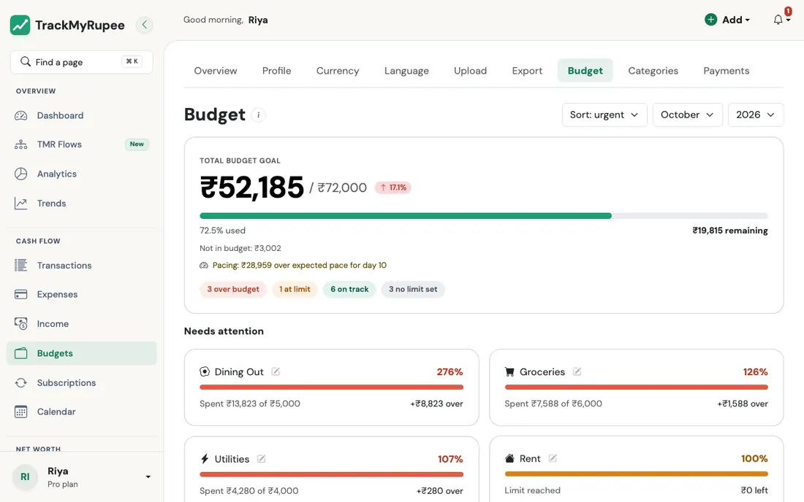
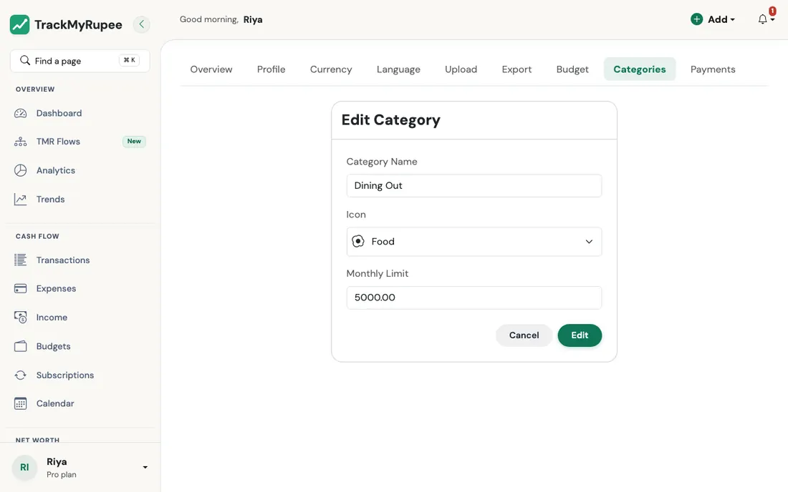

# Budgets

Set per-category monthly spending limits and get alerted before you overshoot.

---

## 1. Opening the Budgets Page

Navigate to **Sidebar → Budgets** on desktop, or go to **More → Budgets** from the mobile bottom sheet.

{ loading=lazy }

The page shows a **Total Budget Goal** bar at the top, which displays how much of your overall budget envelope has been used. Below that, individual category bars show the spend versus the limit for each category. Status pill counts at the top tell you at a glance how many categories are over budget, at their limit, on track, or have no limit set.

### What counts as spending in a category

For the month you are looking at, a category's spend is:

- every **expense** in that category, including the ones your subscriptions post automatically, converted to your own currency (the category name is matched ignoring capital letters, so *food* counts towards *Food*), plus
- any **Capital Event** whose **Exclude from Budget** switch is turned off. It counts towards the category with the same name as its subtype (for example *Large Purchase*). By default capital events are excluded. See [Capital Events](../09-capital-events/index.md).

Loan interest and transfers are not budget spending.

### The numbers at the top

| Number | What it means |
|---|---|
| **Total budget** | The limits of all categories that have a limit, added up |
| **Spent against budget** | Spend in those categories only |
| **Unbudgeted spend** | Everything else you spent this month: categories with no limit, and expenses whose category no longer exists |
| **Total spent** | Budgeted and unbudgeted spend together |
| **vs last month** | Total spent compared with the month before |

---

## 2. Setting a Category Limit

{ loading=lazy }

1. Find the category you want to limit in the list.
2. Click the **pencil (edit) icon** next to the category name.
3. Enter the monthly limit in your own currency.
4. Click **Save**.

You can also set a limit when you create a category from the **Categories** page. The progress bar for that category updates immediately to show the new limit against your existing spend for the current period.

!!! info "Categories without a limit"
    If a category has no limit set, it appears in the list but without a progress bar. The budget bar only activates once you set a limit. Leave the limit blank, or enter 0, for no limit. A limit cannot be negative.

!!! note "Renaming and deleting categories"
    Renaming a category renames it on all your expenses, subscriptions, and quick-add suggestions too, so your history stays in the same bar. If you delete a category, its expenses are kept but no longer belong to any budget, so they show up as unbudgeted spend.

### How many categories you can budget

The number of categories depends on your plan: **Free 5, Plus 15, Pro unlimited**. On Free and Plus, your oldest categories up to that number are usable. Any extra ones are locked: you cannot edit them, they are not offered when you add an expense, they do not appear on the Budget page, and they send no alerts.

---

## 3. Reading the "Needs Attention" Section

Each category has one of four states, shown by a status pill and the colour of its bar:

| State | When | Colour |
|---|---|---|
| **Over budget** | You have spent **more than** the limit | Red |
| **At limit** | You have used **85 percent or more** of the limit, up to and including exactly the limit | Amber |
| **On track** | Under 85 percent of the limit | Green |
| **No limit** | No limit is set | No bar |

The **Needs Attention** section lists the categories that are over budget or at their limit, with the most urgent first. This is your primary action list for the current cycle. The same 85 percent rule colours the category bars on your Dashboard, and it is also when you get an alert.

### Budget alerts

You get a notification when a category first reaches **85 percent** of its limit ("Budget Alert") and another when it goes **over** ("Budget Exceeded"). Each is sent at most once per category per month. Categories with no limit, and locked categories, never send alerts.

### Pace

For the current month, the Total Budget Goal card also shows your **pace**: how your spending so far compares with spending the whole budget evenly across the days of the month. If you are more than 5 percent of your total budget ahead of that even pace, it tells you how much over pace you are. If you are more than 5 percent behind it, it tells you how much under. Otherwise it says you are on track. Past months and months with no budget show no pace.

---

## 4. Adjusting a Limit Mid-Cycle

You can raise or lower a category limit at any time during the month. Changing the limit does not alter any past transactions. Your existing spend stays as it is; only the percentages recalculate. A category has one limit, which applies to every month: if you change it, past months you look at afterwards are measured against the new limit too.

Use this to course-correct if a limit was set too tightly for an unusual month.

---

## 5. Filtering by Period

The Budget page has **month and year** selectors at the top, and a sort menu (most urgent first, by name, by limit, or by amount spent). Use the selectors to view budget adherence for a specific month, and to compare how a category performed across different months. The budget is always one calendar month at a time.

!!! example "Real-world use case"
    Mid-cycle, Pooja notices her Dining Out bar has reached 210 percent of its Rs. 5,000 limit. She has two choices: raise the limit to Rs. 10,000 to match reality for this cycle (useful if she had a special occasion), or commit to cooking at home for the remaining weeks and use the budget bar as a daily check-in. She uses the month selector to check whether last month's Dining Out spend was also over Rs. 5,000 before deciding whether to raise the limit. Because a category has a single limit, she knows that raising it will also change how past months look.

---

## Related Links
- [Adding Expenses](../03-transactions-expenses/index.md)
- [Analytics, Trends and Financial Health](../11-analytics-and-health/index.md)
