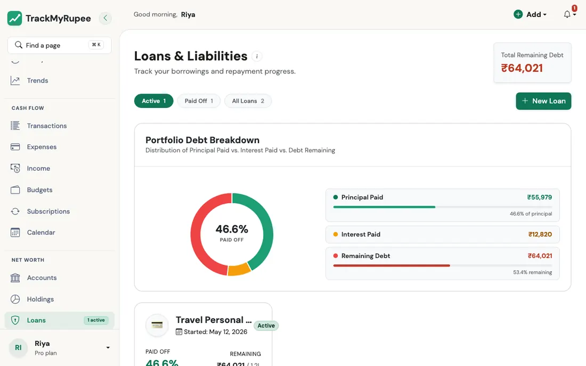
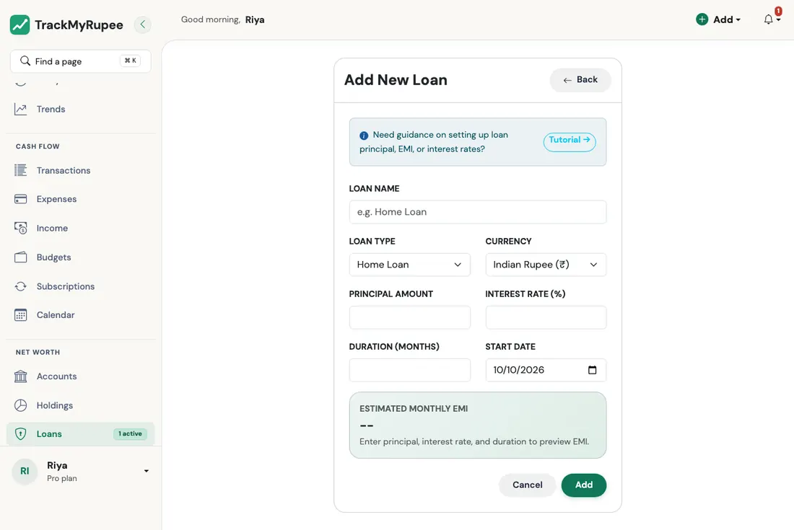
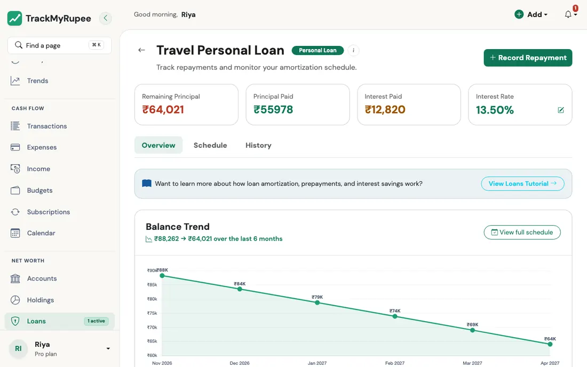

title: Loans
description: Track loan repayments, outstanding principal, and differences between EMI and bullet-style loan behavior in TrackMyRupee.
keywords: TrackMyRupee loans, EMI, gold loan, bullet repayment, outstanding principal

# Loans

Track your active loans, watch repayment progress, and let the app calculate your remaining principal automatically.

!!! note "Plan required"
    The Loans feature is available on the Plus and Pro plans. **Plus** lets you track **one active loan at a time**, **Pro** has no limit. A loan that is fully paid off no longer uses up your allowance, so on Plus you can add your next loan as soon as the current one closes. On the Free plan the Loans pages take you to the pricing page.

!!! tip "The quickest way to add a loan"
    The [I took a loan](../13-tmr-flows/debt.md#i-took-a-loan) Flow creates the loan, its interest rate, a recurring EMI, and an optional down payment from one short form, and shows you the calculated EMI before you confirm.

---

## 1. Opening the Loans Page

Navigate to **Sidebar → Loans** on desktop, or go to **More → Loans** on mobile.

{ loading=lazy }

Click **Add** to open the Add New Loan form.

---

## 2. Filling the Loan Form

Complete the following required fields:

{ loading=lazy }

1. **Loan Name**: A short label, for example "HDFC Home Loan" or "Personal Loan Oct 2024".
2. **Loan Type**: Home Loan, Car Loan, Personal Loan, Education Loan, Business Loan, or Other.
3. **Currency**: Defaults to your profile currency.
4. **Principal Amount**: The total amount borrowed. It must be more than zero.
5. **Interest Rate (%)**: The annual interest rate, from 0 to 100.
6. **Duration (Months)**: The total repayment tenure, from 1 to 600 months.
7. **Start Date**: The date the loan was disbursed.

As you fill in the numbers, the form shows a live **Estimated Monthly EMI** preview at the bottom.

Click **Create Loan** to save. The rate you enter becomes the loan's first interest rate, effective from the start date.

!!! info "Interest-only and bullet loans"
    This form creates a standard **EMI** loan. For a loan where you pay only interest each month and settle the whole principal at the end (a bullet or interest-only loan, such as many gold loans), use the [I took a loan](../13-tmr-flows/debt.md#i-took-a-loan) Flow and choose that repayment type. These loans show a schedule of interest-only payments, with the full principal due with the last payment. The same Flow also lets you enter a loan you are already part-way through (principal already paid before you started tracking).

You can also try the numbers first with the free [EMI calculator](https://trackmyrupee.com/loan-emi-calculator/), which works without signing in.

---

## 3. How Repayments Are Logged

There are two ways, and you can mix them.

**Automatically, with a subscription.** Set up a recurring **Loan Repayment** (**Add → Add Subscription**, Transaction Type `Loan Repayment`, linked to the loan). Each time the recurring engine posts it, the repayment is split into interest and principal for you. See [Subscriptions](../05-transactions-recurring/index.md). The [I took a loan](../13-tmr-flows/debt.md#i-took-a-loan) Flow sets this up for you.

**By hand, from the loan page.** Open the loan and use **Record Repayment**. Enter the **amount**, the **account** it was paid from, and the **date** (it cannot be in the future). You can leave the split blank, and TrackMyRupee estimates the interest from the current balance and rate and treats the rest as principal. Or fill in the **principal** and **interest** portions yourself; they must add up to the amount. If you pay more principal than is left, the extra is trimmed, so you can pay a loan off in full. Tick **Make this a recurring loan repayment** to turn it into a subscription with the same amount.

Either way, the account you paid from goes down by the amount, and the remaining principal goes down by the **principal portion only**. To undo a repayment, delete it from the **History** tab and the money goes back to the account.

### How interest is worked out

Interest each month is the **annual rate divided by 12, applied to the balance still owed**: at 12 percent on Rs. 1,00,000, the first month's interest is Rs. 1,000. This is the same rule the EMI formula and the schedule use, so what is posted always matches the schedule. As the balance falls, so does the interest and more of each EMI goes to principal.

### When the rate changes

Use **Update Interest Rate** on the loan page and give the **New Annual Rate** and the date it is **Effective From**. A rate only applies from its effective date: a rate you enter for next month does not change this month's interest. When the app catches up several months of EMIs, each month uses the rate that was in force in that month.

### Down payments and prepayments

A lump sum, such as a down payment or a prepayment, is recorded as a [Capital Event](../09-capital-events/index.md) with the subtype **Loan Down Payment** or **Loan Prepayment**, linked to the loan (the loan page has an **Add Capital Event for this Loan** shortcut). It counts fully as principal paid. Capital events with other subtypes do not change the loan.

---

## 4. Reading the Paid-Off Percentage and Remaining Balance

On the Loans list page, each loan card shows:

{ loading=lazy }

- A paid-off percentage bar: how much of the original principal is gone, counting EMI principal, capital-event prepayments, and any principal you had already paid when you started tracking
- The remaining principal

At the top, **Total Remaining Debt** adds up the remaining principal of all your active loans. If a loan is in a different currency from your own, it is converted to your currency for these totals, while each card keeps its own currency.

Use the **Active**, **Paid Off**, and **All Loans** tabs to switch between loans still running and finished ones. Click any loan card to open its detail page, which shows the repayment history, the amortization schedule, the principal-versus-interest breakdown, the interest rate history, and any linked capital events.

### The amortization schedule

The **Schedule** tab lists the payments still to come: from this month until the end of the term, using the remaining balance and the rate in force today. The last payment clears whatever is left. A loan that has not started yet shows its whole term from the start date, and a loan past its term that still owes money shows one final payment. Interest-only and bullet loans show interest every month and the principal with the last payment.

### Pay 1 Extra EMI a Year

For an EMI loan, the **Overview** tab shows what you would save by paying one additional EMI against the principal each year: the **time saved** and the **interest saved**. It is an estimate based on the current balance and rate.

---

## 5. What Happens When a Loan Is Fully Paid Off

When the remaining principal reaches zero, whether through repayments or a prepayment, TrackMyRupee automatically marks the loan as **closed** (inactive). You do not need to do anything manually.

The closed loan moves to the **Paid Off** tab for your records. It no longer counts as a liability in your net worth, and on the Plus plan it frees your loan slot. The status always follows the numbers: if you delete the last repayment, or raise the principal when you edit the loan, it reopens by itself.

### Editing and deleting a loan

Use **Edit** to change the name, type, principal, term, start date, or rate. If the loan has only one rate, editing the rate changes that rate; if you have added rate changes since, they are left as they are (use **Update Interest Rate** for new ones). **Deleting** a loan removes all its repayments (and gives the money back to the accounts they were paid from) and its recurring repayment. Capital events you had linked to it are kept, just unlinked.

!!! example "Real-world use case"
    Ravi took a Rs. 1,20,000 personal loan 6 months ago to fund a travel trip. He adds it to TrackMyRupee with Principal Amount Rs. 1,20,000, Interest Rate 14 percent, Duration 12 months, and the disbursement date. The app calculates his estimated EMI at approximately Rs. 10,774 per month. Each time he makes a payment, the recurring engine auto-posts a Loan Repayment entry, and the paid-off percentage bar on the loan card ticks upward, giving him a visible motivation to make an extra prepayment and close it in 10 months instead of 12.

---

## Related Links
- [Accounts and Net Worth](../02-accounts/index.md)
- [Recurring Transactions and Subscriptions](../05-transactions-recurring/index.md)
- [Capital Events](../09-capital-events/index.md)
