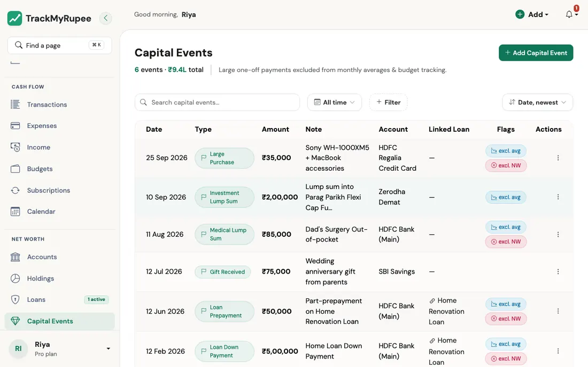
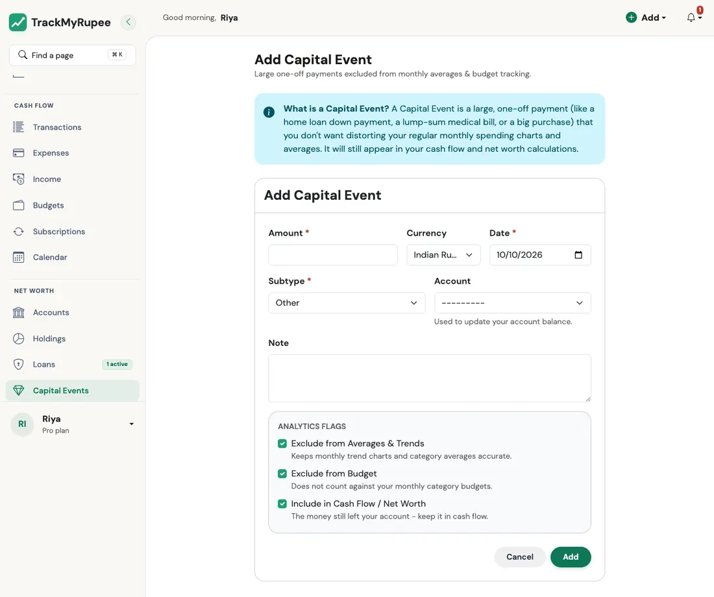
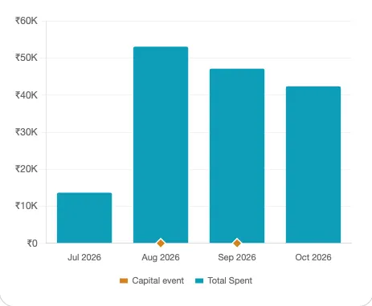

# Capital Events

Record large, one-time payments without distorting your regular monthly expense analytics.

---

## 1. What Is a Capital Event

A Capital Event is a large, one-off payment that you do not want skewing your regular monthly spending charts.

Examples include a home loan down payment, a lump-sum medical bill, a car purchase, or a big renovation payment.

The rule of thumb is this: if the amount is large enough to make your average monthly expense chart look abnormal for several months, log it as a Capital Event instead of a regular expense.

---

## 2. What a Capital Event Does (and the Three Switches)

By default a Capital Event is **kept out of your everyday numbers but still moves your money**. Three switches on the form control this. They are all on when you start, and you can change each one per event:

| Switch | When it is **on** (the default) | When you turn it **off** |
|---|---|---|
| **Exclude from Averages & Trends** | The event does not count as spending in your monthly totals, your savings rate, or your trend charts. It shows as a small marker on the dashboard charts instead. | It counts as spending for that month, like a regular expense. |
| **Exclude from Budget** | It does not count against your category budgets. | It appears in your budget breakdown as its own line, named after its subtype (for example *Large Purchase*). |
| **Include in Cash Flow / Net Worth** | The account you chose goes down by the amount, so your balance and net worth stay true. | The account balance is not touched. Use this when the money did not actually leave an account you track. |

So the usual one-off payment leaves your Dining Out, Transport, and Groceries budget bars alone, and your Analytics averages keep reflecting your real recurring spend, while your account balance still drops by the right amount.

!!! info "Account balances follow the event"
    Add it and the account goes down. Edit the amount and it changes by the difference. Move it to another account and the money moves with it. Delete it, or turn off **Include in Cash Flow / Net Worth**, and the account gets the money back. If you pick an account in another currency, the account is charged in its own currency.

---

## 3. Opening the Capital Event Form

{ loading=lazy }

- **Desktop**: Navigate to **Sidebar → Capital Events → Add**.
- **Mobile**: Go to **More → Capital Events → Add**.

The form is titled "Add Capital Event". You can also start it from an existing expense, see [Converting Between Expenses and Capital Events](#7-converting-between-expenses-and-capital-events).

---

## 4. Filling the Form

Complete the following fields:

{ loading=lazy }

1. **Amount** (required): The total amount of the payment. It must be greater than zero.
2. **Currency**: Defaults to your profile currency.
3. **Date** (required): The date the payment was made. It cannot be in the future.
4. **Subtype** (required): What kind of event it is. The choices are **Loan Down Payment, Loan Prepayment, Large Purchase, Medical Lump Sum, Gift Given, Gift Received, Investment Lump Sum,** and **Other**.
5. **Account** (optional): The account the money came from. Leave it empty and no balance changes.
6. **Linked Loan** (optional): Connect a down payment or prepayment to one of your active loans.
7. **Note** (optional): A short description, such as "Kitchen renovation advance".
8. The three switches described above.

Click **Save** when done.

---

## 5. Linking a Capital Event to a Loan

If you are recording a home loan down payment or a lump-sum prepayment on an existing loan, use the **Linked Loan** field to connect the Capital Event to that loan record.

Only events with the subtype **Loan Down Payment** or **Loan Prepayment** reduce the loan's remaining principal. Every rupee of one counts as principal paid, on top of what your EMIs have already repaid, so the loan's outstanding balance and your total liabilities both go down. Deleting the event gives the principal back. A linked event with any other subtype is only attached to the loan for reference and does not change the balance. The loan detail page shows the capital payments next to your EMIs.

!!! example "Real-world use case"
    Kavya pays a Rs. 4,00,000 home renovation advance in July. She logs it as a Capital Event with Subtype: Large Purchase, Account: HDFC Savings, Amount: 4,00,000, rather than as a regular expense. Her HDFC Savings account balance drops correctly and her net worth reflects the outflow. But her Dining Out, Groceries, and Transport budget bars are unaffected, and the Analytics average monthly expense chart for the rest of the year still shows her real recurring spend instead of a Rs. 4,00,000 spike warping every future month-over-month comparison.

---

## 6. Seeing Capital Events on Your Charts

Capital Events that are kept out of your spending averages (the default) are not hidden: you still want to see **when** they happened. So they appear on the spending trend charts on your Dashboard as small **amber diamonds sitting on the bottom axis**, directly under the day (or month) they happened. An event you have switched to count as spending is already part of the line, so it gets no diamond.

{ loading=lazy width="463" }

- On the **Daily Expenses** chart (a single month), look for a diamond under the date of the event.
- On the **Expenses Trend** chart (a year), a diamond sits under each month that has an event.
- **Hover** over that day or month, and the tooltip lists the event by name and amount alongside the usual figures, for example *Investment Lump Sum, ₹1L*.
- The chart legend has a matching **Capital event** entry, so the diamond is never a mystery.

A diamond never changes the height of the spending line or bars. It is a marker, like a pin on a map, and not a spend.

!!! tip "Some Flows create Capital Events for you"
    You will not always have to add them by hand. The [TMR Flows](../13-tmr-flows/index.md) create them where it makes sense: a loan's down payment, an FD's principal, a gold purchase, and a car bought with cash.

---

## 7. The Capital Events Page, Editing, and Deleting

The **Capital Events** page opens on the current period and shows the number of events and their total (in your own currency). You can search the note, filter by event type, account, or amount, and sort by date or amount. See [Search and Filters](../14-filters-and-search/index.md).

Open an event to edit any field. To delete one, confirm the prompt. The account gets its money back.

### Converting Between Expenses and Capital Events

- **Expense to Capital Event**: If you logged something big as an ordinary expense, choose **Convert to Capital Event** in its menu on the Expenses list. The expense is replaced by an equal Capital Event for the same date, account, and amount, so the money is charged once, not twice.
- **Capital Event to Expense**: On the Capital Events page, choose **Convert to Expense**. The event becomes a regular expense named after its note (or its subtype), filed under the subtype's name. If the event had **Include in Cash Flow / Net Worth** turned off, the new expense is created without an account, so no balance moves that never moved before.

!!! tip "Recurring Capital Events"
    A repeating one-off, such as an instalment on a purchase, can be set up as a **Capital Event** subscription. See [Recurring Transactions and Subscriptions](../05-transactions-recurring/index.md).

---

## Related Links
- [Loans](../08-loans/index.md)
- [Analytics, Trends and Financial Health](../11-analytics-and-health/index.md)
- [Budgets](../07-budgets/index.md)
