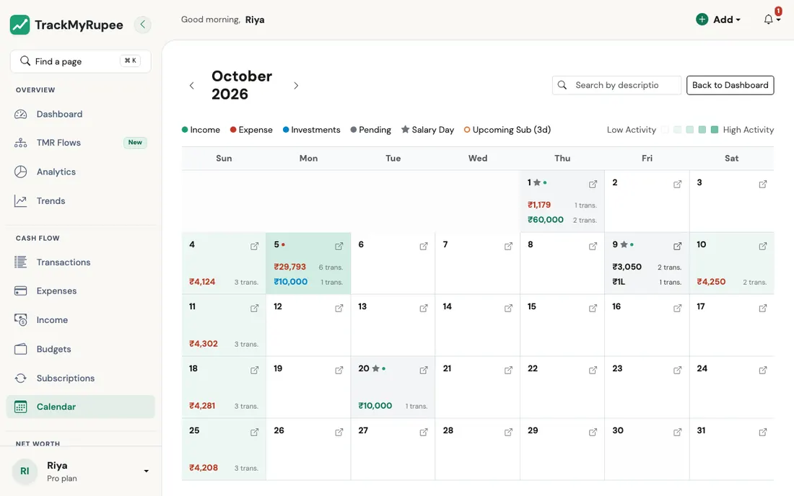

title: Calendar
description: A month at a glance in TrackMyRupee, with what you earned, spent and invested each day, what is scheduled to come, and a detail panel for any day.
keywords: TrackMyRupee calendar, daily cash flow, upcoming subscriptions, salary day, heat map

# Calendar

See your whole month on one screen: what came in, what went out, what you invested, and which scheduled payments are about to hit.

---

## 1. Opening the Calendar

Navigate to **Sidebar → Calendar** on desktop, or go to **More → Calendar** on mobile (URL: `/calendar/`).

{ loading=lazy }

The top row holds the month with its previous and next arrows, the search box, and a **Back to Dashboard** button. The month grid is sized to fit your screen, so you can see all of it without scrolling. The day detail sits just below it.

---

## 2. Reading a Day

Each day shows the money that moved, in your own currency:

| On the day | What it is |
|---|---|
| **Green, with +** | Income received |
| **Red, with −** | Money that went out: expenses, loan EMIs (the whole payment, principal and interest), and Capital Events |
| **Blue** | Money you moved into investment accounts |
| **Grey list at the bottom** | Scheduled entries (subscriptions, SIPs, EMIs, expected income) that have not posted yet |

Each amount also shows how many transactions make it up, such as *2 txns*. Transfers between your own accounts (for example Savings to Cash) are not money spent, so they do not appear in the day's totals. They are listed in the day detail.

On a phone, each day is a small tile with coloured dots for income, expense, investment and scheduled items. Tap it to read the amounts.

### The legend

| Marker | Meaning |
|---|---|
| Green, red, blue and grey dots | Income, expense, investments, pending |
| ★ (amber star) | A **salary day**: income marked as salary arrived, or a scheduled salary is due |
| Amber outline and **Due soon** | Something scheduled is due today or in the next 3 days |
| Dark circle on the number | Today |
| Light to dark green shade | How much money moved that day (income + expenses + investments). The busiest day of the month is the darkest |

The colours follow your light or dark theme.

---

## 3. Opening a Day

Tap or click any day. The page glides down to the **day detail**:

- **Transactions**: everything that happened that day, with its category and account. Click a row to open and edit it.
- **Scheduled**: entries due that day that have not posted yet.
- **Coming up**: the next few days that have something due, so you can plan ahead.
- **View in transactions** opens the full list for that single day. Use the **↑** button to return to the calendar.

Today is opened automatically when you view the current month.

---

## 4. Scheduled Entries

Entries that have not happened yet are shown on the day they are due. They use the same rules the app uses when it posts them: a schedule that runs on the **last day of the month** or the **last working day** lands on the real month end, a monthly schedule from the 31st stays on the month's last day in short months, and a schedule stops after its end date. Entries already posted appear as real transactions, never as scheduled. Paused schedules, and schedules whose account is inactive, are not shown. Amounts in another currency are shown in your currency.

---

## 5. Using the Search Box

Type a word such as a merchant, a category, a source, a loan name or an investment account. Every figure on the calendar and in the day detail then counts only the matching entries, including scheduled ones. Clear the box to see everything again.

!!! example "Real-world use case"
    Deepak notices an unusually dark day in August. He taps it and finds three separate grocery orders totalling Rs. 2,400 that he does not remember placing. He realises a household member used his account, and the day detail gave him the full trail in seconds. He then searches "grocery" to see that pattern across the whole month, and turns on spending notifications.

---

## Related Links
- [Adding Expenses](../03-transactions-expenses/index.md)
- [Recurring Transactions and Subscriptions](../05-transactions-recurring/index.md)
- [Capital Events](../09-capital-events/index.md)
- [Analytics, Trends and Financial Health](../11-analytics-and-health/index.md)
