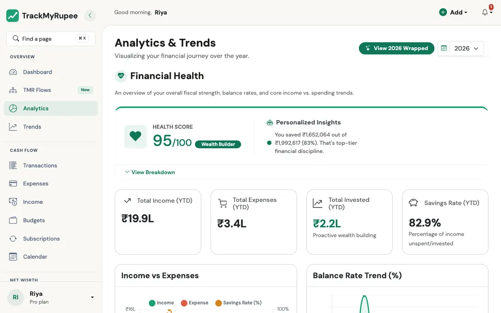
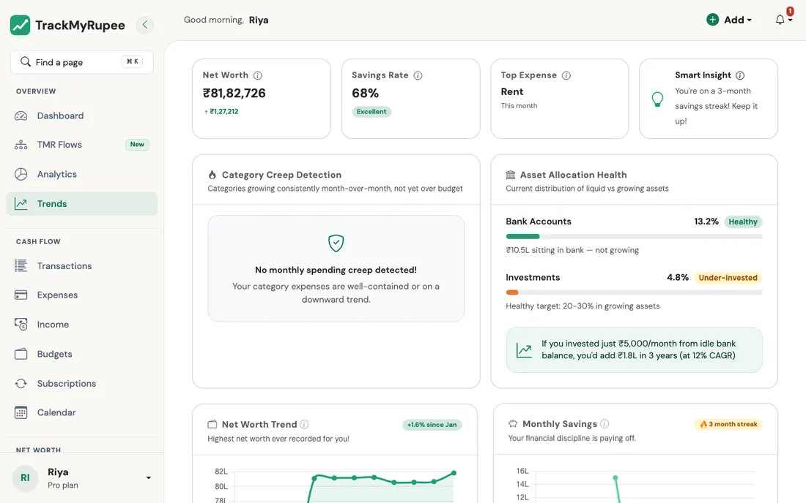

# Analytics, Trends and Financial Health

Understand your savings rate, spending patterns, and overall financial health with data-driven summaries.

---

## 1. Opening Analytics

Navigate to **Sidebar → Analytics** on desktop, or go to **More → Analytics** on mobile (URL: `/analytics/`).

{ loading=lazy }

---

## 2. Reading the Financial Health Score

The **Health Score** card at the top of the Analytics page shows a score from 0 to 100. The score is calculated from your year-to-date (YTD) savings rate:

| Score | What it means | Savings rate |
|---|---|---|
| 10 | Needs attention | Negative (spending more than income) |
| 40 | Needs improvement | 0 to 20 percent |
| 70 (Stable) | On track | 20 to 30 percent |
| 95 (Wealth Builder) | Excellent | 30 percent or more |

Expand the **Health Breakdown** section to see the four component metrics that make up the score:

- **Savings Rate**: The percentage of income saved year-to-date
- **Expense Growth**: Your current monthly average spend compared to your 3-month historical average
- **Consistency**: How many of the last 10 months had positive savings
- **Risk Buffer**: Months of financial runway, calculated as YTD savings divided by average monthly expense

---

## 3. How the Savings Rate Is Calculated

Every place in TrackMyRupee that shows a savings rate uses the same formula: the **Dashboard** headline, the **Analytics** Health Score and monthly trend, **Month on Month**, the **Net Remaining** tile on the Transactions page, and the **monthly email report**. They can differ only because they look at different time periods or filters, never because they calculate it differently.

> **Savings** = Income − Expenses − Loan interest − Capital Events that count towards averages
>
> **Savings rate** = Savings ÷ (Income − Cashback and Refund income) × 100

A few rules sit behind that:

- **Loan principal is not spending.** When you pay an EMI, only the **interest** part counts as money spent. The principal part is you repaying money you borrowed, so it does not reduce your savings.
- **Capital Events count only if you chose so.** A Capital Event is left out by default (its **Exclude from Averages & Trends** setting is on), so one big purchase does not wreck the month. Turn that setting off on an event and it counts as spending. The **Include capital events** switch on the Analytics chart temporarily adds the excluded ones.
- **Cashback and Refunds are money in, but not part of the base.** Cashback and Rewards and Refund / Reimbursement income is added to your savings (the money really is yours), but it is left out of the amount your rate is measured against. Your rate is measured against what you *earned*, so a refund can only improve it, never dilute it.
- **No income, no rate.** If the base is zero or less, the rate shows 0 instead of a misleading number. Spending more than you earn gives a negative rate.
- **Everything is in your own currency.** Foreign amounts are converted when you save them.

!!! example "A worked example"
    In a month Ananya earns a Rs. 50,000 salary and gets Rs. 1,000 cashback. She spends Rs. 20,000 on regular expenses and pays an EMI of Rs. 8,000, of which Rs. 2,000 is interest.

    - Savings = 51,000 − 20,000 − 2,000 = **Rs. 29,000** (the Rs. 6,000 of principal is not counted)
    - Base = 51,000 − 1,000 = 50,000
    - Savings rate = 29,000 ÷ 50,000 = **58%**

---

## 4. Understanding YTD Totals

The Analytics page shows year-to-date totals for Income, Expenses, and Invested amounts, along with a YTD Savings Rate. These are factual summaries of the data you have logged. They are not predictions or advice.

---

## 5. Reading the Trends Page

Navigate to **Sidebar → Trends** on desktop, or go to **More → Analytics → Trends** on mobile (URL: `/trends/`).

{ loading=lazy }

The Trends page shows two key analyses:

- **Category Creep Detection**: Identifies categories where your spend has grown significantly compared to a previous period. This helps you spot gradual increases before they become a problem.
- **Asset Allocation Health**: Shows how your wealth is distributed across cash, fixed-income, and market-linked investments. A flag appears if too much wealth is sitting idle in low-yield accounts.

---

## 6. Using Year and Date Selectors

Both the Analytics and Trends pages have year and date range selectors at the top. Use these to:

- Compare your current year's performance against a prior year
- Zoom into a specific period such as a quarter or a custom date range

---

## 7. An Important Note on All Insights

The Financial Health score, the insights panel, and all Trends analyses are **descriptive summaries of your own historical data**. They show what has happened in your records.

They are not financial advice and they do not predict future outcomes. Use them as data-informed prompts for your own decision-making.

!!! example "Real-world use case"
    Nisha is considering applying for a personal loan and wants to understand her financial standing first. She opens Analytics and checks her Health Score. It shows 40 (savings rate 12 percent, Needs Improvement). She then opens Trends and sees an over-idle flag: Rs. 1.8 lakh sitting in a Savings Account earning 3 percent per year. She transfers Rs. 80,000 into her Mutual Fund account via Add → Internal Transfer, which shifts her asset allocation. Two months later, with her savings rate up to 22 percent and the idle-cash flag cleared, her Health Score moves to 70 (Stable), giving her a cleaner financial picture before she approaches a lender.

---

## Related Links
- [Accounts and Net Worth](../02-accounts/index.md)
- [Budgets](../07-budgets/index.md)
- [Transfers](../06-transfers/index.md)
- [Philosophy](../00-philosophy.md)
