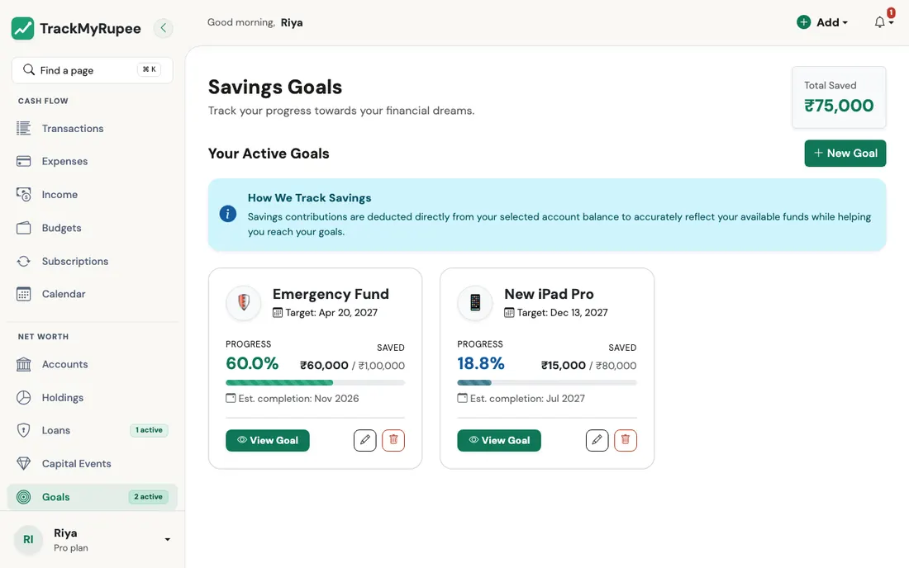
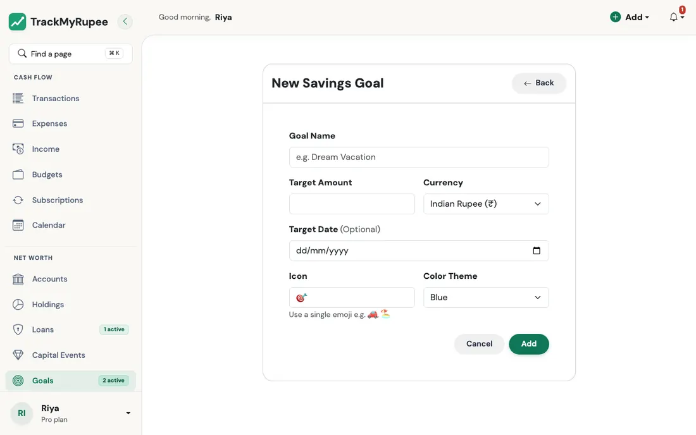
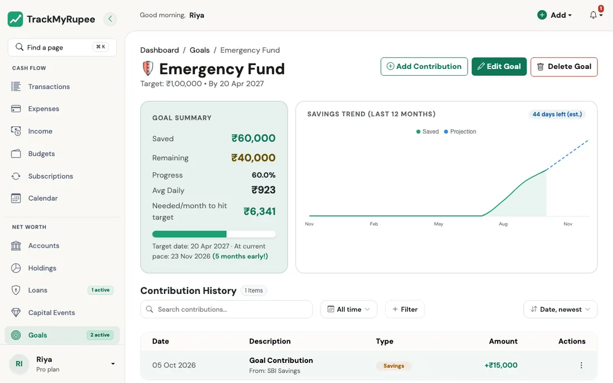

title: Savings Goals
description: Set a savings target, add contributions from your accounts, and see progress, pace and a projected finish date in TrackMyRupee.
keywords: TrackMyRupee savings goals, goal contribution, target date, progress, emergency fund

# Savings Goals

Set a target, set money aside towards it from your accounts, and see how close you are, how fast you are going, and when you are likely to finish.

!!! note "How many goals your plan allows"
    **Free** lets you keep **1** goal, **Plus** keeps **5**, and **Pro** has no limit. If you have more goals than your plan allows (for example after a downgrade), the oldest ones stay usable and the newer ones are **locked**: you can still see them and delete them, but you cannot edit them or add or change contributions until you upgrade or free a slot.

!!! tip "Start a goal in under a minute"
    The [I'm saving for something](../13-tmr-flows/savings-and-investments.md#im-saving-for-something) Flow sets up a goal with a target, a deadline, and a colour from a single short form.

---

## 1. Opening the Goals Page

Navigate to **Sidebar → Goals** on desktop, or go to **More → Goals** on mobile.

{ loading=lazy }

The page shows **Total Saved** across all your goals, in your own currency (a goal in another currency is converted), and a card for each goal with its progress bar, target and estimated finish. Click **New Goal** to add one.

---

## 2. Creating a Goal

Fill in the following fields:

{ loading=lazy }

1. **Goal Name**: A short label, for example "Goa Trip Fund", "Emergency Reserve", or "MacBook".
2. **Target Amount**: The total you want to reach. It must be more than zero.
3. **Currency**: Defaults to your own. Pick another if you are saving in it. **It cannot be changed after money has been added**, because each contribution was charged to its account at that currency.
4. **Target Date** (optional): A deadline. For a new goal it must be today or later. With a date set, the goal tells you how much to save each month and whether you are on track.
5. **Icon** and **Colour**: How the goal looks on your list.

Click **Save**.

---

## 3. Adding a Contribution

Open a goal and click **Add Contribution**. Enter the **amount**, the **account** it comes from, and the **date** (not in the future). All three are needed.

The contribution takes the amount **out of that account's balance** and adds it to the goal. If the account is in a different currency, it is charged the converted amount in its own currency. Your **net worth does not drop**: money you have set aside for a goal is still yours, so it is added back when net worth is worked out.

You can **edit** a contribution (the account and goal balances move by the difference) or **delete** it (the money goes back to the account). Deleting a whole goal returns every contribution to the account it came from.

!!! tip "Use a dedicated savings account"
    Create a separate Savings Account (for example "Goa Trip Savings"), and transfer your monthly amount to it from your salary account with **Add → Internal Transfer**. Then log the goal contribution from that account.

---

## 4. Reading the Goal

Each goal shows:

{ loading=lazy }

- **Saved**, **Target** and **Remaining**, with a progress bar (it stops at 100 percent even if you save more)
- **Estimated completion**: your **average daily pace** since your first contribution, carried forward until the remaining amount is reached. One early, large contribution makes the pace look fast, so treat it as an estimate that settles as you keep contributing
- **Needed per month** (with a target date): what is left divided by the months until the deadline
- **On track or not**: you are on track when the estimated finish is on or before the target date. If not, the goal shows how much more per month you would need. A goal whose target date has passed shows the whole remaining amount as still needed
- **Early or late**: for example "12 days early" or "2 months late"
- **Savings trend**: the last 30 days for a young goal, or the last 12 months for an older one, with a dotted line projecting to the target

The **Contribution History** lists every contribution. You can search it and filter by account or amount.

---

## 5. When a Goal Is Reached

As soon as the saved amount reaches the target, the goal is marked **Achieved** automatically, and it leaves your "active goals" count. If you later delete or reduce a contribution so the amount falls below the target, or you raise the target, the goal opens again by itself. There is nothing to mark by hand, and no money moves when a goal is achieved.

To change the name, target, date, icon or colour, click **Edit Goal**. Lowering the target below what you have saved completes the goal.

!!! example "Real-world use case"
    Priya wants to save Rs. 80,000 for a Goa trip in March, about four months away. She creates a goal with Target Rs. 80,000 and Target Date 01 Mar, and the goal tells her she needs roughly Rs. 20,000 a month. Each time her salary arrives she transfers Rs. 20,000 to her Goa Savings account and logs a contribution from it. The progress bar climbs from 25 to 50 to 75 percent, the estimate shows "on time", and when the last contribution brings the total to Rs. 80,000 the goal shows Achieved.

---

## Related Links
- [Getting Started](../01-getting-started/index.md)
- [Accounts and Net Worth](../02-accounts/index.md)
- [Transfers](../06-transfers/index.md)
- [Analytics and Health](../11-analytics-and-health/index.md)
