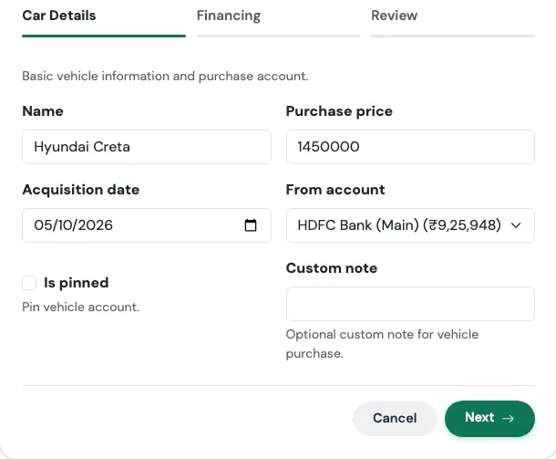
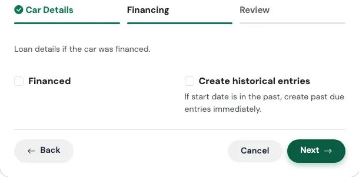
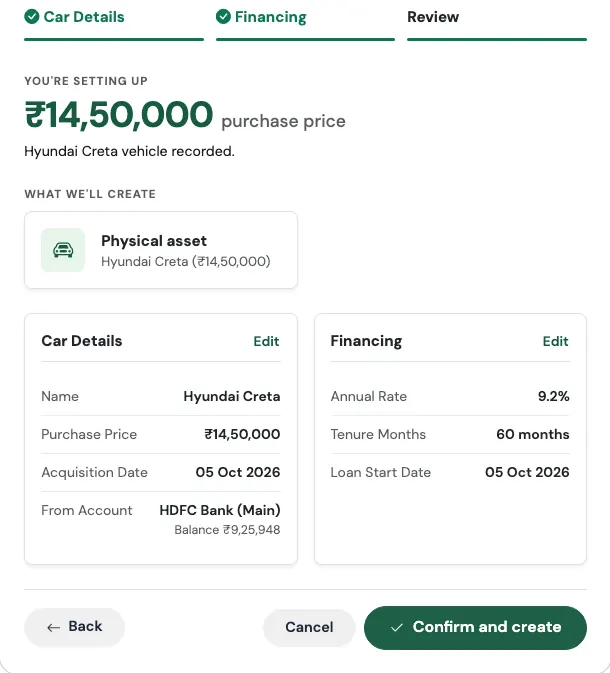
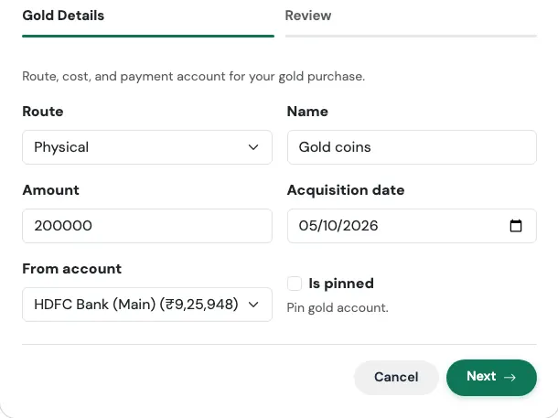
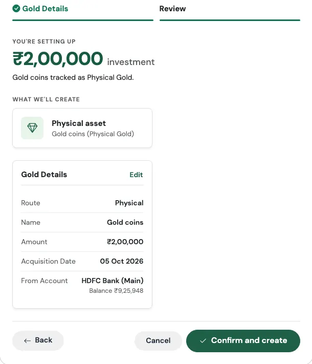

# Assets Flows

Some purchases are not spending, they are **owning**. A car and a piece of gold are still worth money after you buy them. The two Flows in the **Assets** category, **I bought a car** and **I bought gold**, make sure those things show up in your net worth instead of vanishing from your picture the day you pay for them.

---

## I Bought a Car

> *Cash or financed, either way it lands in your net worth.*

### Think of it like registering the car at the RTO

When you register a car, it gets a number and an official record with your name on it. If there is a bank loan behind it, that loan is noted on the same record. This Flow creates both halves for you: the car as something you own, and the loan (if any) as something you owe, linked together.

### When to use it

Use it when you buy a vehicle, whether you paid cash or took a car loan. It takes about two minutes.

### What you fill in

**Step 1: Car Details**

{ loading=lazy width="560" }

| Field | What to enter |
|---|---|
| **Name** | What you call the car, such as "Hyundai i20". |
| **Purchase price** | What the car cost. |
| **Acquisition date** | The day you bought it. |
| **From account** | The account the money (or the EMIs) comes from. |
| **Is pinned** | Optional. Pins the vehicle to the top of your accounts. |
| **Custom note** | Optional. Replaces the default note on the purchase entry. |

**Step 2: Financing**

{ loading=lazy width="560" }

| Field | What to enter |
|---|---|
| **Financed** | Tick this if you took a loan for the car. Leave it off for a cash purchase. |
| **Loan name** | A name for the loan. If you leave it blank, it becomes "your car name Loan". |
| **Annual rate** | Required when financed. The yearly interest rate. |
| **Tenure months** | Required when financed. The loan length in months. |
| **Loan start date** | Defaults to the purchase date. |
| **Create historical entries** | Turn on if the loan began in the past and you want earlier EMIs added now. |

**Review and confirm**

The last tab summarises what will be created, with the headline figure at the top, before anything is saved. Check it, then press **Confirm and create**. Use **Edit** on any card to jump back to that step.

{ loading=lazy width="560" }

### What gets created

This is the one Flow where the answer depends on how you paid.

**Always:**

- The **car as an asset**, with its purchase price and a starting value
- A **Vehicle account**, so the car counts toward your net worth

**If you paid cash (Financed is off):**

- A **Capital Event** of type *Large Purchase* for the full price, taken from the account you chose. The money really did leave your account, and this records that without distorting your monthly spending.

**If you financed it (Financed is on):**

- A **car loan** with its interest rate
- A **recurring EMI**, paid from the account you chose
- A **Vehicle Loan account** linked to the loan

There is **no** purchase Capital Event in this case. The loan and the vehicle together already tell the whole story, and a second entry would count the same money twice.

!!! example "Real-world use case: financed"
    Siddharth buys a car for ₹9,00,000 and finances all of it at 9% for 60 months. He runs **I bought a car**, enters the price and date, ticks **Financed**, and fills in 9 and 60.

    His net worth now shows the car at ₹9,00,000 as something he owns and the loan at ₹9,00,000 as something he owes, so net worth does not jump or crash on the day he drives it home. Every month an EMI of about ₹18,683 goes out of his chosen account, and his remaining loan balance falls with it.

!!! example "Real-world use case: cash"
    Rekha pays ₹6,50,000 from her savings for a hatchback. She runs the same Flow and leaves **Financed** off. Her savings account drops by ₹6,50,000, a Large Purchase appears in Capital Events, and the car shows up as a ₹6,50,000 asset. Her monthly spending report still looks normal, because a car is not a "this month" expense. It is a change in where her wealth is stored.

### Watch out for

!!! warning "A financed car here means 100% financed"
    The Flow treats a financed car as fully covered by the loan. If you paid a down payment yourself, set the loan up with [I took a loan](debt.md#i-took-a-loan) (which has a down payment option), and add the vehicle as an account on the [Accounts](../02-accounts/index.md) page. If this is common for you, use **Request a flow** on the TMR Flows page and tell us.

!!! note "The car is carried at what you paid"
    The Flow records the car at its purchase price. Cars lose value as they age, so over the years your net worth will slightly overstate what the car would actually sell for. Keep that in mind when you read the number.

---

## I Bought Gold

> *Physical jewelry or digital/SGB, tracked either way.*

### Think of it like a locker

Whether it is your mother's jewellery in a bank locker, or a Sovereign Gold Bond sitting in a demat account, it is gold, it is yours, and it counts. This Flow puts it in your picture, the same way, whichever form it takes.

### When to use it

Use it when you buy gold, in any form. It takes under a minute.

### What you fill in

{ loading=lazy width="560" }

| Field | What to enter |
|---|---|
| **Route** | **Physical** for jewellery, coins, or bars, or **Digital SGB** for Sovereign Gold Bonds and similar digital gold. |
| **Name** | What to call it, such as "Diwali necklace" or "SGB 2026 Series II". |
| **Amount** | What you paid. |
| **Acquisition date** | The day you bought it. |
| **From account** | Optional. The account you paid from. |
| **Is pinned** | Optional. Pins the account to the top of your list. |

**Review and confirm**

The last tab summarises what will be created, with the headline figure at the top, before anything is saved. Check it, then press **Confirm and create**. Use **Edit** on any card to jump back to that step.

{ loading=lazy width="560" }

### What gets created

The result depends on the route you picked.

**Physical:**

- A **gold asset** with its purchase price and a starting value
- A **Gold account** holding that value
- A **gold holding** at your cost price

**Digital SGB:**

- A **Sovereign Gold Bond account**
- A **holding** at your cost price

**Either way, if you chose a From account:**

- A **Capital Event** of type *Investment Lump Sum*, taking the amount out of that account on the purchase date. If you leave From account blank, nothing is taken out of any account, which is handy when you are adding gold you bought years ago.

!!! example "Real-world use case"
    Meghna buys a gold necklace for ₹1,20,000 before Diwali, paying from her savings account. She runs **I bought gold**, chooses Physical, names it "Diwali necklace", enters 120000, the date, and her savings account.

    Her savings drop by ₹1,20,000, the necklace appears as a ₹1,20,000 asset, and the purchase is filed under Capital Events, so her Dashboard does not make it look like she overspent on festive shopping.

    A year later she adds her father's old coins, which she inherited. For those she runs the Flow again and leaves **From account** blank, because she did not pay for them, and her net worth simply grows by the value she records.

### Watch out for

!!! note "Gold is carried at what you paid"
    Gold prices move every day, but the Flow records your purchase cost and uses that as the value. Your net worth will not follow the market price of gold. Think of it as the gold being counted at the price on the day you bought it.

---

## Related Links
- [TMR Flows overview](index.md)
- [Debt Flows](debt.md)
- [Capital Events](../09-capital-events/index.md)
- [Holdings and Mutual Funds](../02-accounts/holdings.md)
- [Accounts and Net Worth](../02-accounts/index.md)
