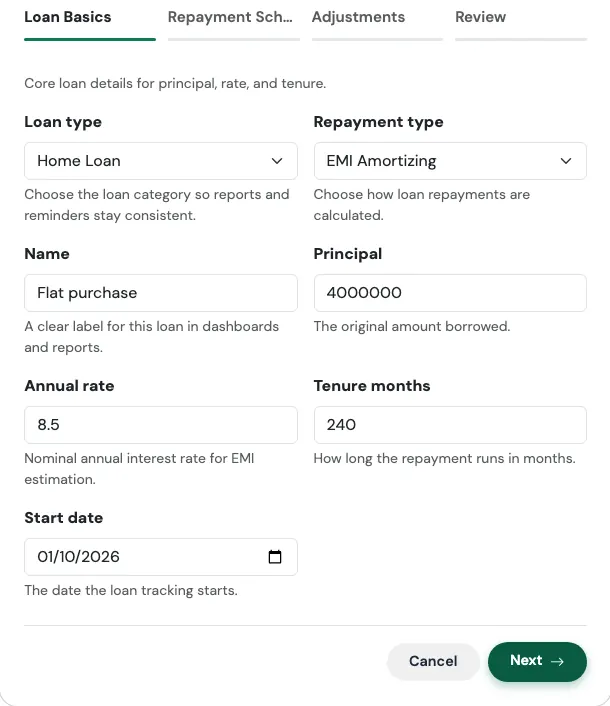
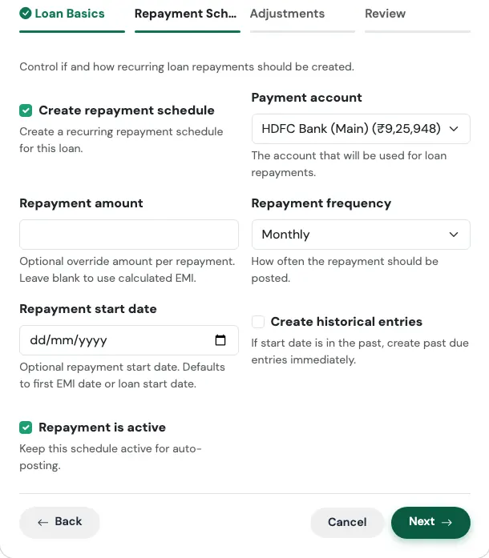
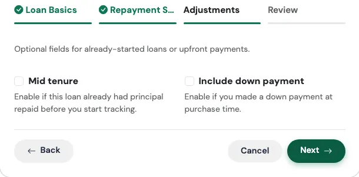
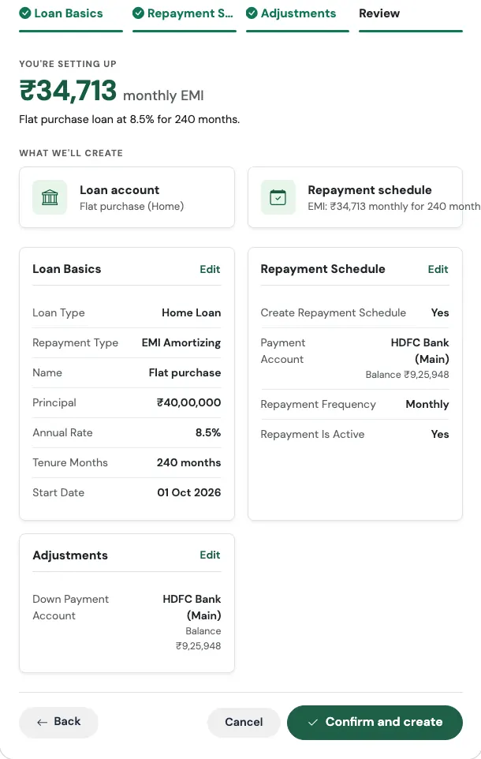
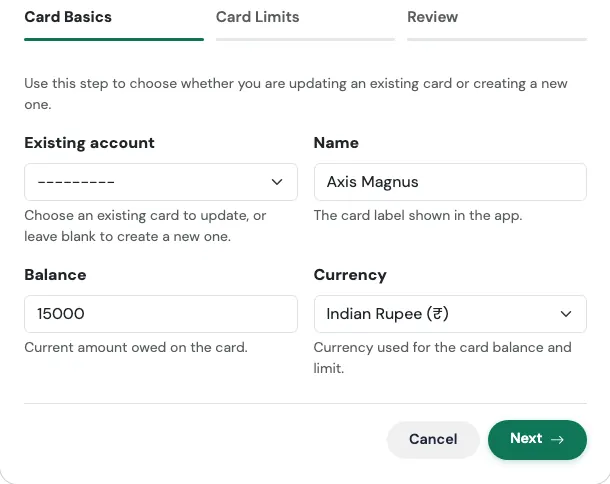
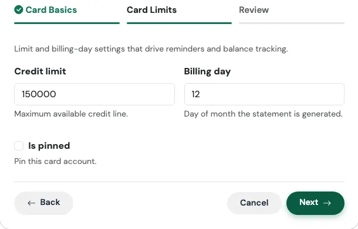
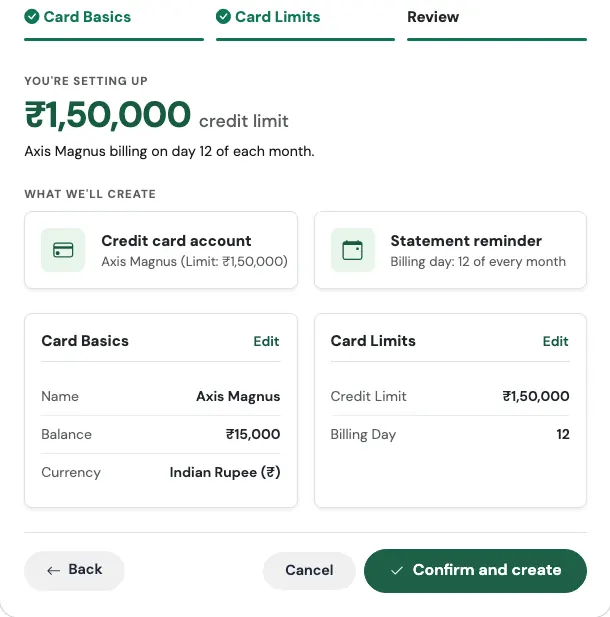

# Debt Flows

Two Flows live in the **Debt** category: **I took a loan** and **I got a credit card**.

---

## I Took a Loan

> *Home, car or personal. Add it once and EMIs track themselves.*

### Think of it like a railway timetable

When a new train is introduced, the railway does not send a person to the station every day to announce it. The timetable is printed once, and the train simply runs on schedule. This Flow does the same for your loan. You enter the loan once, and every EMI shows up on its due date without you doing anything.

### When to use it

Use it any time a new loan enters your life: a home loan, a personal loan, an education loan, a business loan, or anything else you will repay in instalments. It takes about two minutes.

### What you fill in

The form has three steps.

**Step 1: Loan Basics**

{ loading=lazy width="560" }

| Field | What to enter |
|---|---|
| **Loan type** | Home, Car, Personal, Education, Business, or Other. This keeps your reports and reminders tidy. |
| **Repayment type** | **EMI Amortizing** (the usual kind, where every month is the same amount), **Bullet Repayment** (you pay everything at the end), or **Interest Only** (you pay only the interest each month and the principal later). |
| **Name** | A label you will recognise, such as "HDFC Home Loan". |
| **Principal** | The original amount you borrowed. |
| **Annual rate** | The yearly interest rate, for example 8.5. |
| **Tenure months** | How long the loan runs, in months. A 20-year loan is 240. |
| **Start date** | The date the loan begins. |

**Step 2: Repayment Schedule**

{ loading=lazy width="560" }

| Field | What to enter |
|---|---|
| **Create repayment schedule** | On by default. This is what makes the EMI post by itself every month. |
| **Payment account** | The account the EMI is paid from. |
| **Repayment amount** | Leave this blank and TrackMyRupee uses the EMI it calculates. Fill it in only if your bank's figure is slightly different. |
| **Repayment frequency** | Monthly by default. |
| **Repayment start date** | Optional. Defaults to the first EMI date, or the loan start date. |
| **Create historical entries** | Turn on if the loan started in the past and you want the earlier EMIs posted now. See [the backfill switch](index.md#4-create-historical-entries-the-backfill-switch). |
| **Repayment is active** | Keep this on so the schedule keeps posting. |

**Step 3: Adjustments** (both parts are optional)

{ loading=lazy width="560" }

- **Mid tenure**: for a loan you took some time ago. Enter how much principal you have already repaid and the date of your first EMI. TrackMyRupee then starts from where you actually are, not from day one.
- **Include down payment**: for loans on a purchase. Enter the down payment amount, the account it came from, and an optional note.

**Review and confirm**

The last tab shows everything before anything is saved. The big number at the top is your monthly EMI. Check it against your bank's figure, then press **Confirm and create**. If something looks off, use the **Edit** link on any card to jump back.

{ loading=lazy width="560" }

### What gets created

- A **loan account** with your balance and interest rate
- A **repayment schedule**, set up as a recurring EMI
- If you included a down payment, a **Capital Event** of type *Loan Down Payment*, linked to the loan

On the Review screen the big number you see is your calculated monthly EMI, so you can compare it with what your bank told you before you confirm.

!!! example "Real-world use case"
    Rohan has just closed on a flat. He borrowed ₹40,00,000 at 8.5% for 20 years from HDFC, with a ₹6,00,000 down payment from his savings account.

    He opens **TMR Flows**, picks **I took a loan**, chooses **Home** and **EMI Amortizing**, names it "HDFC Home Loan", and enters 4000000, 8.5 and 240, with 5 November as the start date. On the schedule step he picks his salary account as the payment account. On the adjustments step he switches on the down payment and enters 600000.

    The Review screen shows a monthly EMI of ₹34,713. That matches his bank's sanction letter, so he confirms. His Loans page now shows the loan, his EMI is scheduled for the 5th of every month, and the down payment sits in Capital Events, so it never distorts his monthly spending.

### Watch out for

!!! warning "Already a few EMIs in? Use Mid tenure"
    If you took the loan two years ago and you start the loan at today's date with the full principal, your remaining balance will look far too high. Use the **Mid tenure** option and enter the principal you have already paid.

!!! note "A few sanity checks"
    The form will not let you save a loan where the principal you have already repaid is as large as, or larger than, the loan itself. It will also ask for a repayment amount if the calculated EMI comes out as zero, which can happen with a 0% rate.

!!! tip "Rate changes later"
    Floating-rate loans change over time. You can update the interest rate afterwards from the loan itself. See [Loans](../08-loans/index.md).

---

## I Got a Credit Card

> *Balance, limit and the billing cycle in one pass.*

### Think of it like a hotel minibar tab

You pick up snacks all week, the amount just keeps adding up, and you settle on checkout day. A credit card works the same way, and the one thing you must not forget is the checkout day. This Flow stores your card, how much you owe, how much room you have left, and the day the statement is generated, so a reminder reaches you in time.

### When to use it

Use it when you get a new card, or when you want to add an existing one that you have not tracked yet. It takes about a minute.

### What you fill in

**Step 1: Card Basics**

{ loading=lazy width="560" }

| Field | What to enter |
|---|---|
| **Existing account** | Optional. Pick a card you already added to update it instead of creating a duplicate. Leave blank for a brand-new card. |
| **Name** | The label shown in the app, such as "ICICI Amazon Pay". |
| **Balance** | The amount you currently **owe** on the card. Enter it as a positive number. Zero is fine for a new card. |
| **Currency** | Defaults to your profile currency. |

**Step 2: Card Limits**

{ loading=lazy width="560" }

| Field | What to enter |
|---|---|
| **Credit limit** | The maximum your bank allows you to spend on the card. |
| **Billing day** | The day of the month your statement is generated, from 1 to 31. |
| **Is pinned** | Optional. Pins the card to the top of your accounts. |

**Review and confirm**

The last tab summarises what will be created, with the headline figure at the top, before anything is saved. Check it, then press **Confirm and create**. Use **Edit** on any card to jump back to that step.

{ loading=lazy width="560" }

### What gets created

- A **credit card account** that tracks what you owe against your limit
- A **billing cycle** based on your billing day
- A **reminder three days before each statement**, so a bill never catches you off guard

!!! example "Real-world use case"
    Neha gets an Axis Neo card with a ₹1,50,000 limit. The statement is generated on the 18th. She has already spent ₹32,000 in the first week.

    She runs **I got a credit card**, enters the name, 32000 as the balance, 150000 as the limit, and 18 as the billing day. The Review screen shows her ₹1,50,000 limit and "billing on day 18 of each month", so she knows the details are right before confirming. On the 15th of every month she now gets a reminder, three days before the statement lands, which is exactly when she checks whether she wants to pay early.

### Watch out for

!!! warning "Balance means what you owe"
    Enter a positive number for what you owe, not a negative one. TrackMyRupee records it as money you owe, so it reduces your net worth automatically.

!!! tip "Already added this card by hand?"
    Pick it in **Existing account** so the Flow updates the limit and billing day instead of creating a second copy.

---

## Related Links
- [TMR Flows overview](index.md)
- [Loans](../08-loans/index.md)
- [Capital Events](../09-capital-events/index.md)
- [Accounts and Net Worth](../02-accounts/index.md)
