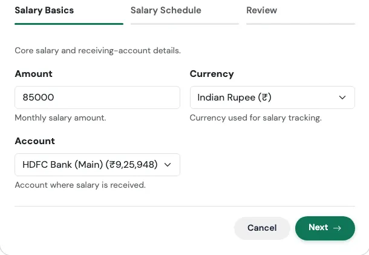
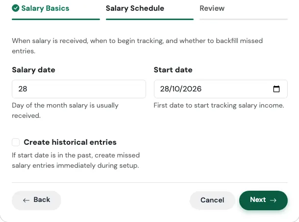
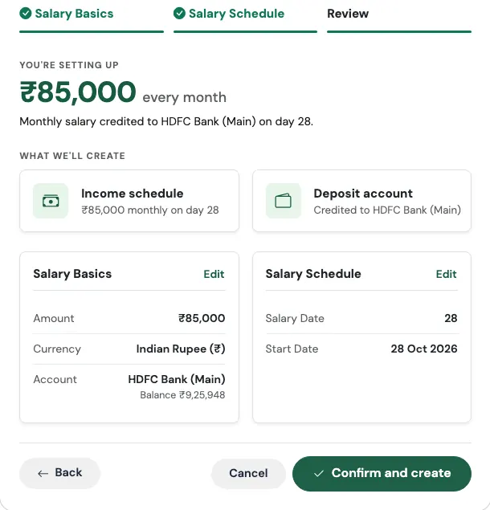
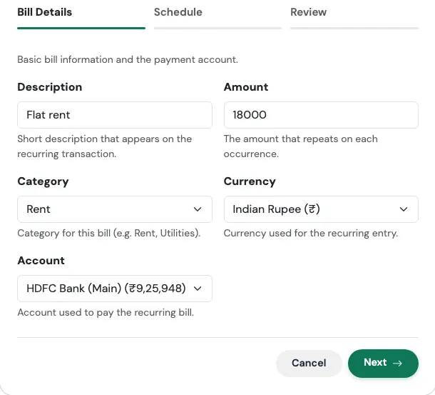
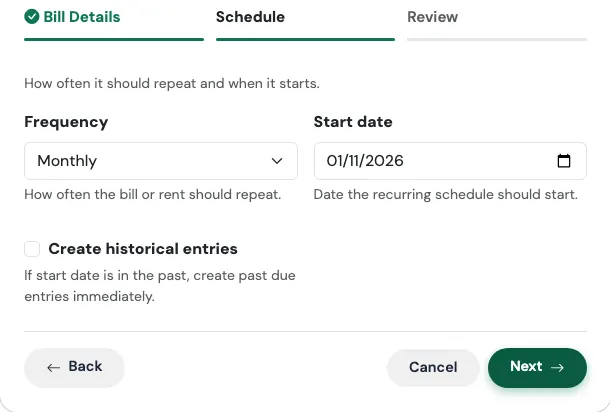
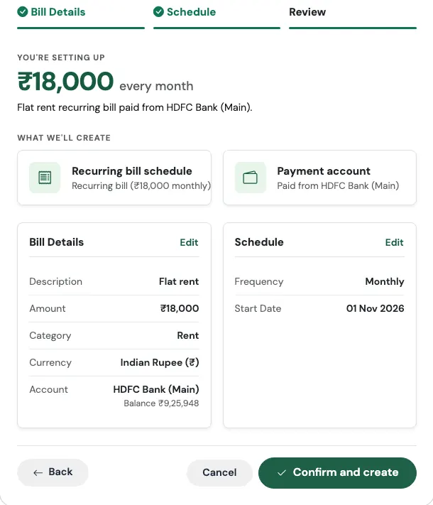
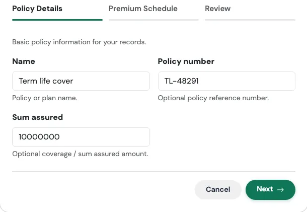
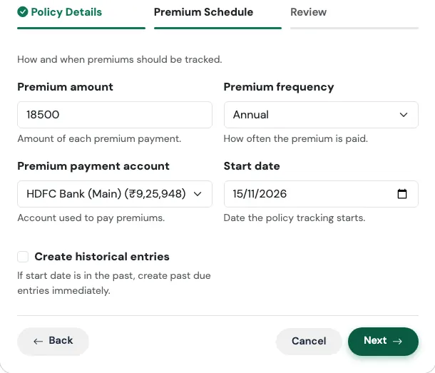
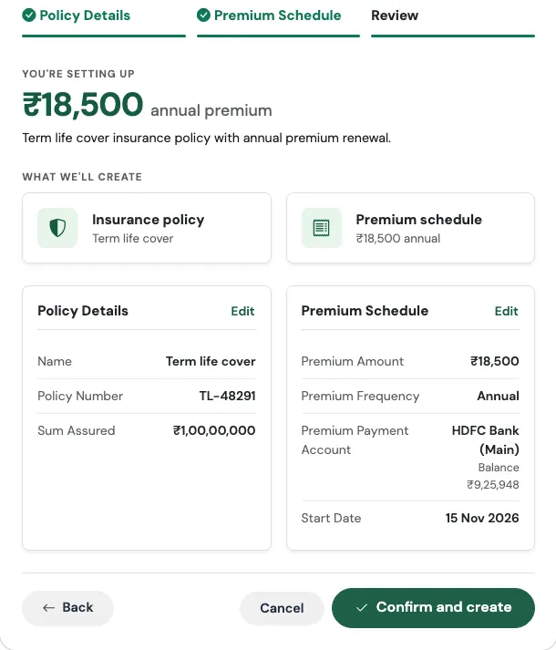

# Income and Bills Flows

Three Flows cover the money that comes in and the bills that go out on a schedule: **I started a new job**, **I pay rent**, and **I bought insurance**.

---

## I Started a New Job

> *Salary, pay day and the salary cycle for your month view.*

### Think of it like setting an alarm for pay day

Your phone alarm does not care what the date is. It only needs to know the time you want to wake up. In the same way, TrackMyRupee needs to know the day your salary lands, so it can draw the boundaries of "your month" in the right place. Your month might not run from the 1st to the 31st. It runs from pay day to the day before the next pay day.

### When to use it

Use it when you start a new job, change employers, or have never told the app your pay day. It takes about a minute.

### What you fill in

**Step 1: Salary Basics**

{ loading=lazy width="560" }

| Field | What to enter |
|---|---|
| **Amount** | Your monthly salary, the amount that actually reaches your account. |
| **Currency** | Defaults to your profile currency. |
| **Account** | The account where your salary is credited. |

**Step 2: Salary Schedule**

{ loading=lazy width="560" }

| Field | What to enter |
|---|---|
| **Salary date** | The day of the month your salary usually arrives, for example 28. |
| **Start date** | The first date to track salary from. The Flow moves it forward to your first real pay day on or after that date. So a start date of 1 October with a pay day of 28 means your first salary entry is on 28 October. |
| **Create historical entries** | Turn on if your start date is in the past and you want the missed months added now. See [the backfill switch](index.md#4-create-historical-entries-the-backfill-switch). |

**Review and confirm**

The last tab summarises what will be created, with the headline figure at the top, before anything is saved. Check it, then press **Confirm and create**. Use **Edit** on any card to jump back to that step.

{ loading=lazy width="560" }

### What gets created

- A **recurring income entry**, repeating monthly, labelled as Salary
- Your **salary date saved on your profile**
- An updated **month-cycle view**, so the Dashboard, Budgets and Analytics all measure "this month" from pay day to pay day

This is the same salary cycle described in [Getting Started](../01-getting-started/index.md). The Flow simply sets it for you at the same time as it sets up the income, so the two can never disagree.

!!! example "Real-world use case"
    Imran joins a new company on 1 October. His salary of ₹85,000 reaches his HDFC Salary Account on the 28th of every month.

    He runs **I started a new job** on 10 October, enters 85000, picks HDFC Salary Account, sets the salary date to 28 and the start date to 1 October. The Flow lines his first salary entry up with the first 28th, which is 28 October. Straight away, the Dashboard stops saying "01 Oct to 31 Oct" and starts saying "28 Sep to 27 Oct". His budgets now reset on pay day, which is the day he actually has fresh money, instead of on the 1st when he is still living off last month's salary.

### Watch out for

!!! tip "Where to change it later"
    The pay day itself lives in your profile settings. The salary amount lives with your other recurring entries under [Subscriptions](../05-transactions-recurring/index.md). When you get a raise, edit the recurring salary entry there.

!!! warning "Use the amount you actually receive"
    Enter your take-home pay, not your CTC. Your savings rate is calculated from what reaches your bank, so using CTC will make your savings look better than they really are.

---

## I Pay Rent

> *A recurring bill with a due date and reminder.*

### Think of it like a standing instruction to the milkman

You tell him once: "One litre every morning." After that, he turns up whether you remember or not, and the cost quietly lands on your account at the end of the month. A recurring bill works exactly like that, except this time the delivery is a reminder and an automatic entry in your expenses.

Despite the name, this Flow is not only for rent. It works for **any bill that repeats**: society maintenance, broadband, electricity, a tuition fee, a maid's salary.

### When to use it

Use it when you have a bill with a regular amount and a regular date. It takes about a minute.

### What you fill in

**Step 1: Bill Details**

{ loading=lazy width="560" }

| Field | What to enter |
|---|---|
| **Description** | What the bill is, such as "Flat rent" or "Airtel broadband". |
| **Amount** | The amount that repeats each time. |
| **Category** | For example Rent or Utilities. If you leave it blank, it is filed under Rent. |
| **Currency** | Defaults to your profile currency. |
| **Account** | The account the bill is paid from. |

**Step 2: Schedule**

{ loading=lazy width="560" }

| Field | What to enter |
|---|---|
| **Frequency** | Daily, Weekly, Bi-Weekly, Monthly, Quarterly, Semi-Annually, or Yearly. |
| **Start date** | The date of the first (or next) payment. |
| **Create historical entries** | Turn on if the start date is in the past and you want earlier payments added. |

**Review and confirm**

The last tab summarises what will be created, with the headline figure at the top, before anything is saved. Check it, then press **Confirm and create**. Use **Edit** on any card to jump back to that step.

{ loading=lazy width="560" }

### What gets created

- A **recurring expense entry** that posts automatically on each due date
- A **due-date reminder**, so you hear about it before it is due

!!! example "Real-world use case"
    Suresh pays ₹22,000 rent on the 1st of every month, by UPI from his savings account. He runs **I pay rent**, types "Flat rent" as the description, enters 22000, chooses Monthly and 1 November as the start date.

    From now on, on the 1st of every month, ₹22,000 lands in his Housing spending without a single tap, and his Budgets page shows the rent already accounted for. He does the same Flow again for his ₹1,800 broadband, picking a different description, and in five minutes his fixed costs are fully mapped.

### Watch out for

!!! tip "Rent that changes every year"
    When the landlord raises the rent, do not run the Flow again. Open the existing bill in [Subscriptions](../05-transactions-recurring/index.md) and edit the amount. That way your history stays in one place.

---

## I Bought Insurance

> *Policy details and the premium that renews on its own.*

### Think of it like the reminder for your seat belt

You do not think about it every day, but when it matters, you are glad it was there. Insurance premiums have the same problem: they are easy to forget, and a lapsed policy is painful. This Flow records the policy once and puts the premium on a schedule, so it never silently lapses.

### When to use it

Use it for term life, health, or any policy with a recurring premium. It takes about a minute.

### What you fill in

**Step 1: Policy Details**

{ loading=lazy width="560" }

| Field | What to enter |
|---|---|
| **Name** | The policy or plan name, such as "HDFC Click 2 Protect". |
| **Policy number** | Optional, but handy to have in one place. |
| **Sum assured** | Optional. The coverage amount. |

**Step 2: Premium Schedule**

{ loading=lazy width="560" }

| Field | What to enter |
|---|---|
| **Premium amount** | What you pay each time. |
| **Premium frequency** | Annual, Semi-Annual, Quarterly, or Monthly. |
| **Premium payment account** | The account the premium is paid from. |
| **Start date** | The date the policy tracking starts. |
| **Create historical entries** | Turn on to add past premiums if the policy started earlier. |

**Review and confirm**

The last tab summarises what will be created, with the headline figure at the top, before anything is saved. Check it, then press **Confirm and create**. Use **Edit** on any card to jump back to that step.

{ loading=lazy width="560" }

### What gets created

- A **policy record** with your policy number, premium, and sum assured
- A linked **insurance account**, so the policy appears alongside your other accounts
- A **recurring premium payment** on the frequency you chose

The Review screen leads with your premium in the frequency you chose, for example *₹18,500 annual premium*, so you can check it against your policy document before confirming.

!!! example "Real-world use case"
    Priya buys a term plan with ₹1 crore of cover. The premium is ₹18,500 a year, due each March, paid from her savings account.

    She enters the policy name and number, adds 10000000 as the sum assured, picks Annual, and selects 3 March as the start date. The premium now posts on its own each March. Two years later, when a colleague asks her what her policy number is, she does not have to dig through email. It is sitting right there in her accounts.

### Watch out for

!!! warning "Monthly premiums add up"
    A premium of ₹1,500 a month looks small, but it is ₹18,000 a year. When you compare two plans, multiply the monthly one by 12 so you are comparing like with like.

---

## Related Links
- [TMR Flows overview](index.md)
- [Getting Started](../01-getting-started/index.md)
- [Recurring and Subscriptions](../05-transactions-recurring/index.md)
- [Budgets](../07-budgets/index.md)
