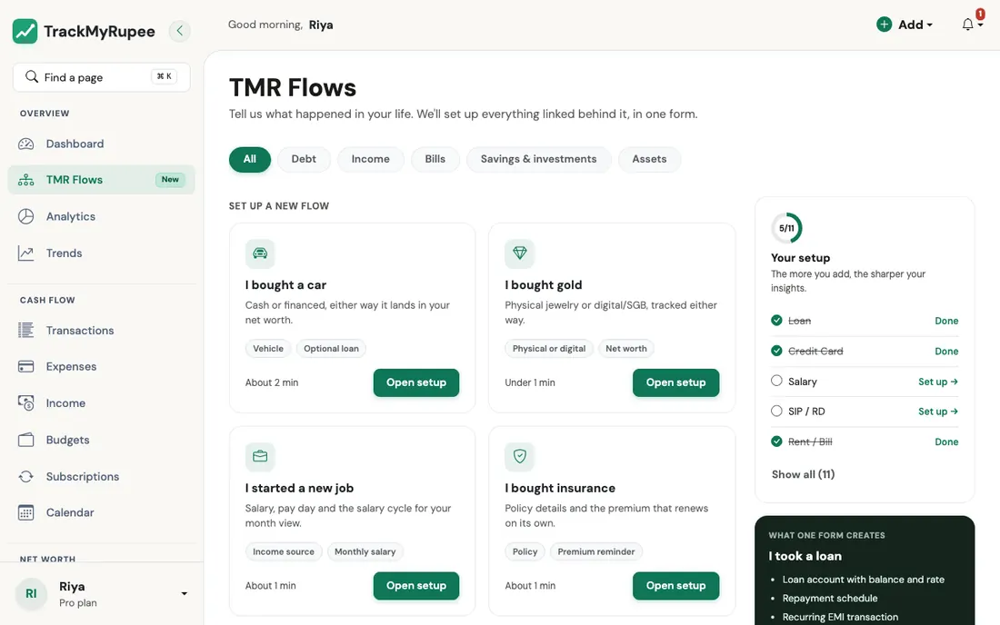

# TMR Flows

Tell TrackMyRupee what happened in your life, and it sets up everything connected to it in one go.

---

## 1. What a Flow Is

Think about what happens when you move to a new flat. You do not call the electricity board, then the gas agency, then the Wi-Fi company, then the bank, one by one, each with a different form. You tell a friendly agent "I have moved", and all of that gets updated together.

A **TMR Flow** works the same way. Without Flows, if you take a car loan, you would:

1. Create a loan record.
2. Add the interest rate.
3. Set up a recurring EMI.
4. Record the down payment as a capital event.
5. Add the car as an asset.

With the **I bought a car** Flow, you answer one short form and all five things are created for you, properly linked to each other.

There are 11 Flows today, grouped into five categories:

| Category | Flows |
|---|---|
| [Debt](debt.md) | I took a loan, I got a credit card |
| [Income and bills](income-and-bills.md) | I started a new job, I pay rent, I bought insurance |
| [Savings and investments](savings-and-investments.md) | I started a SIP, I booked an FD, I contribute to PPF / EPF / NPS, I'm saving for something |
| [Assets](assets.md) | I bought a car, I bought gold |

---

## 2. Opening TMR Flows

Click **TMR Flows** in the sidebar on desktop. It carries a small **New** badge for now.

{ loading=lazy }

The page opens with the line *"Tell us what happened in your life. We'll set up everything linked behind it, in one form."* Below it you will find:

- **Category tabs** across the top: All, Debt, Income, Bills, Savings & investments, and Assets. Tap one to narrow the list.
- **Set up a new flow**: the Flows you have not used yet. Each card has a one-line description, a few tags, and a rough time estimate such as "About 1 min".
- **Already set up**: the Flows TrackMyRupee can see you have already covered. Each of these has an **Edit existing** link that takes you to the right page to change things (for example, your loan list for the Loan Flow, or your accounts page for a credit card).
- **Your setup**: a small progress panel with a count such as 3/11 and a checklist of the core Flows (Loan, Credit Card, Salary, SIP / RD, and Rent / Bill). It is not a test. It is just a quick way to see which areas of your money the app already knows about.
- **What one form creates**: a preview panel that lists everything the selected Flow will create, so there are no surprises.
- **Request a flow**: if your situation is not on the list, tell us and we will build it.

!!! tip "Not sure where to start?"
    Most people get the best result from this order: **I started a new job** (so your month is measured correctly), then **I pay rent**, then **I took a loan** or **I got a credit card** if they apply. After those four, your Dashboard already starts to make sense.

---

## 3. How a Flow Works

Every Flow follows the same three moves.

### Step 1: Fill in the details

The form is split into short steps with a progress label such as **Step 1 of 2**. Each field has a line of help text underneath it in plain language. Fields marked optional can be skipped.

### Step 2: Review

Before anything is saved, you land on a **Review** screen. It shows:

- **You're setting up**: a one-line summary in plain words, such as *"₹5,000 every month. SIP into Nifty 50 Index Fund from HDFC Salary, starting 15 Oct 2026."*
- **What we'll create**: a short list of cards, one for each thing that will be added to your account.
- **Your answers**: everything you typed, each section with an **Edit** link so you can fix a mistake without starting over.
- **Warnings**, if any. The most common one is a plan limit (see below).

### Step 3: Confirm

Press **Confirm and create**. You are taken to the Dashboard with a success message, and everything is in place. Nothing is created until you press this button, so you can always press **Back** or **Cancel** safely.

!!! example "Think of it like a restaurant bill"
    The Review screen is the itemised bill that comes to the table before you pay. You can see every item, question anything that looks off, and only then hand over the card.

---

## 4. "Create Historical Entries": The Backfill Switch

Many Flows have a checkbox called **Create historical entries**. It only matters when your start date is in the past, so it is worth understanding once.

- **Off (the default)**: TrackMyRupee starts fresh. It does not touch the past. The schedule begins from the next upcoming due date.
- **On**: TrackMyRupee posts every missed occurrence between your start date and today, right away, so your history is complete.

!!! example "Real-world use case"
    Kavya started her job on 1 July and sets up the salary Flow on 12 October. If she leaves the box **off**, her Dashboard shows salary only from the next pay day onwards, and July, August, and September look empty. If she turns it **on**, three months of salary entries appear immediately and her savings rate for those months is correct.

    The reverse is true for something like a gym membership she no longer cares to track. For that, she keeps the box off, because she does not want old entries cluttering her reports.

---

## 5. Plan Limits

Some Flows create things that count toward your plan, such as accounts, loans, recurring transactions, or savings goals. If a Flow would take you past your limit, the Review screen shows a clear warning, for example that you have used all the recurring transactions your plan allows, with a suggestion to upgrade or remove something you no longer use.

You see this **before** you confirm, so you never half-create something and run into a wall.

---

## 6. Safe to Double-Click, and All or Nothing

Every Flow submission carries a hidden one-time key. If your internet stutters and you press **Confirm and create** twice, or refresh the page after submitting, the Flow is created only once. You will not end up with two loans or two SIPs.

A Flow is also **all or nothing**. If something goes wrong halfway, nothing is saved, so you never end up with a loan that has no EMI attached or a car with no asset record. Fix the problem it points out and try again.

---

## 7. Changing Things Later

A Flow is a quick way to set things up. It is not a lock. Everything it creates is a normal item in the app, so you can edit it from its usual home:

| You set up | Edit it here |
|---|---|
| A loan | [Loans](../08-loans/index.md) |
| A credit card, FD, SIP, PPF/EPF/NPS, insurance, car, or gold | [Accounts](../02-accounts/index.md) |
| Salary, rent, or any other recurring payment | [Subscriptions](../05-transactions-recurring/index.md) |
| A savings goal | [Savings Goals](../12-goals/index.md) |

Running a Flow a second time creates a **new** set of items. For example, running **I took a loan** twice creates two loans. That is exactly what you want when you really do have two loans, and exactly what you do not want if you only meant to fix a typo. For the typo, use **Edit existing**.

---

## Common Mistakes

!!! warning "Running the Flow again to fix a typo"
    This creates a duplicate. Use the **Edit** link on the Review screen before confirming, or **Edit existing** afterwards.

!!! warning "Forgetting the payment account"
    Some Flows let you leave the account blank. That is fine, but the recurring payment will then not reduce any account balance. If you want your balances to stay honest, pick the account the money really leaves from.

!!! warning "Turning on historical entries by habit"
    If your start date is two years ago and you tick the box, you will get 24 backdated entries at once. Great if you want complete history, noisy if you do not.

---

## Related Links
- [Debt Flows](debt.md)
- [Income and Bills Flows](income-and-bills.md)
- [Savings and Investments Flows](savings-and-investments.md)
- [Assets Flows](assets.md)
- [Getting Started](../01-getting-started/index.md)
