# Savings and Investments Flows

Four Flows help you set aside and grow money: **I started a SIP**, **I booked an FD**, **I contribute to PPF / EPF / NPS**, and **I'm saving for something**.

---

## I Started a SIP

> *Link it to a fund and a monthly debit date.*

### Think of it like a gullak that fills itself

Remember the clay piggy bank at home? You dropped in a coin whenever you remembered, and some months you forgot. A SIP is the grown-up version: on a fixed date every month, a fixed amount goes in automatically. This Flow gives TrackMyRupee the same habit. It creates a place to hold your investment and moves the money into it on schedule.

The Flow handles two instruments, and you choose between them on the first screen:

- **SIP**: a monthly investment into a market-linked fund, such as an index fund.
- **RD**: a recurring deposit with a bank or post office, with a fixed interest rate.

### When to use it

Use it any time you start a regular monthly investment. It takes about a minute.

### What you fill in

**Step 1: Investment Basics**

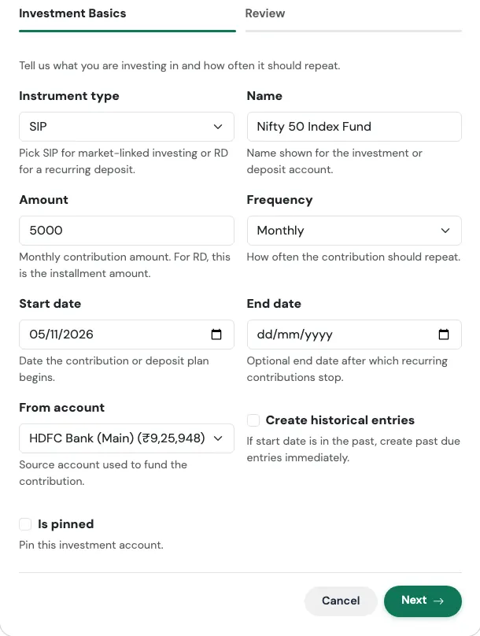{ loading=lazy width="560" }

| Field | What to enter |
|---|---|
| **Instrument type** | **SIP** for market-linked investing, or **RD** for a recurring deposit. |
| **Name** | The name shown for the investment, such as "Nifty 50 Index Fund". |
| **Amount** | The monthly contribution. For an RD, this is the instalment amount. |
| **Frequency** | Monthly by default. |
| **Start date** | The date the plan begins. |
| **End date** | Optional. The date after which contributions stop, for example when an RD ends. |
| **From account** | The bank account the money leaves. |
| **Create historical entries** | Turn on if the start date is in the past and you want earlier contributions added now. |
| **Is pinned** | Optional. Pins the account to the top of your list. |

**Step 2: Recurring Deposit Details** (appears only when you choose **RD**)

| Field | What to enter |
|---|---|
| **Deposit principal** | The opening amount, if any. |
| **Deposit rate** | The annual interest rate. |
| **Deposit compounding** | How often interest is added: simple, quarterly, monthly, or annually. |
| **Deposit maturity date** | When the RD ends. |
| **RD installment day** | The day of the month the instalment is posted. |
| **Show accrued balance** | Show the balance with interest earned so far, instead of only what you put in. |
| **Record maturity income** | Record the interest as income when the RD matures. |

**Review and confirm**

The last tab summarises what will be created, with the headline figure at the top, before anything is saved. Check it, then press **Confirm and create**. Use **Edit** on any card to jump back to that step.

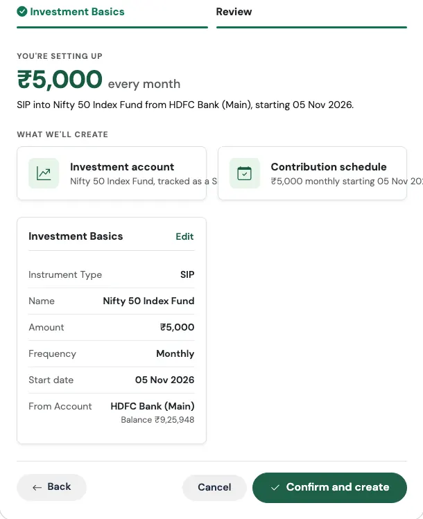{ loading=lazy width="560" }

### What gets created

- An **investment account**: a Mutual Funds account for a SIP, or an RD account for a recurring deposit
- A **recurring monthly transfer** from your bank account into it

On the Review screen the headline is the monthly amount, followed by a plain-English line such as *"SIP into Nifty 50 Index Fund from HDFC Salary, starting 15 Oct 2026."*

!!! example "Real-world use case"
    Aditya decides to invest ₹5,000 every month into a Nifty 50 index fund, with the money leaving his salary account on the 5th.

    He runs **I started a SIP**, keeps the type as SIP, names it "Nifty 50 Index Fund", enters 5000, picks Monthly, a start date of 5 November, and his HDFC Salary account. On Review he sees *"₹5,000 every month"* and two cards: the investment account, and the contribution schedule. After confirming, every 5th his salary account drops by ₹5,000 and the Mutual Funds account rises by the same amount. His net worth does not change on the day, because the money has only moved from one pocket to another, but his asset allocation now includes equity.

### Watch out for

!!! tip "The fund's actual value"
    The Flow records the money you put in. To track the actual number of fund units and their current value, add your holdings afterwards. See [Holdings and Mutual Funds](../02-accounts/holdings.md) and [Accrued vs Invested View](../02-accounts/accrued-vs-invested.md).

!!! warning "SIP and RD are not the same thing"
    A SIP's value moves with the market. An RD's value grows at a fixed rate. If you pick RD, fill in the second step, or the interest will not be tracked.

---

## I Booked an FD

> *Principal, rate and maturity, tracked till it matures.*

### Think of it like planting a tree

You put the seed in the ground (the principal), and you know roughly when it will bear fruit (the maturity date). In between, it grows quietly. An FD Flow tells TrackMyRupee where the seed came from, how fast it grows, and when to expect the fruit.

### When to use it

Use it when you book a new fixed deposit. It takes about a minute.

### What you fill in

**Step 1: Deposit Basics**

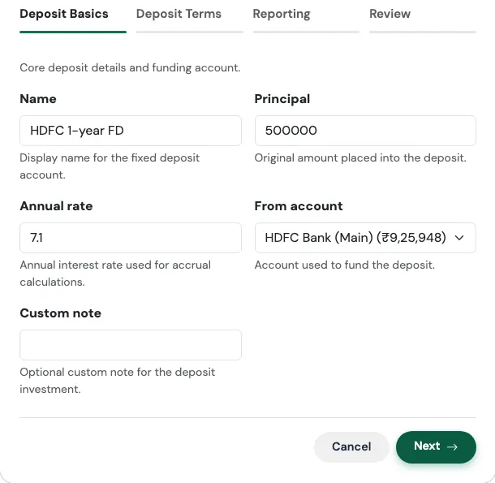{ loading=lazy width="560" }

| Field | What to enter |
|---|---|
| **Name** | A label, such as "SBI 1-year FD". |
| **Principal** | The amount you placed into the deposit. |
| **Annual rate** | The yearly interest rate. |
| **From account** | The account that funded the deposit. |
| **Custom note** | Optional. Overrides the default note on the funding entry. |

**Step 2: Deposit Terms**

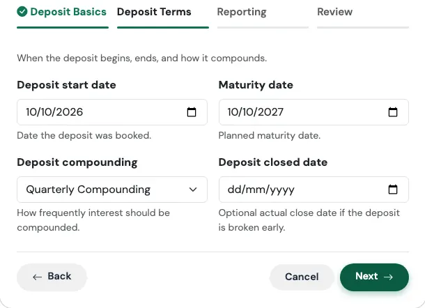{ loading=lazy width="560" }

| Field | What to enter |
|---|---|
| **Deposit start date** | The date you booked it. |
| **Maturity date** | When it matures. |
| **Deposit compounding** | Simple, Quarterly, Monthly, or Annual. Quarterly is the most common for bank FDs. |
| **Deposit closed date** | Optional. Only needed if you broke the FD early. |

**Step 3: Reporting**

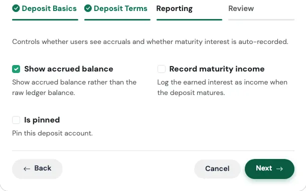{ loading=lazy width="560" }

| Field | What to enter |
|---|---|
| **Show accrued balance** | On by default. Shows the value with interest earned so far, rather than just the amount you invested. |
| **Record maturity income** | Off by default. Turn on to have the interest recorded as income on the maturity date. |
| **Is pinned** | Optional. Pins the account to the top of your list. |

**Review and confirm**

The last tab summarises what will be created, with the headline figure at the top, before anything is saved. Check it, then press **Confirm and create**. Use **Edit** on any card to jump back to that step.

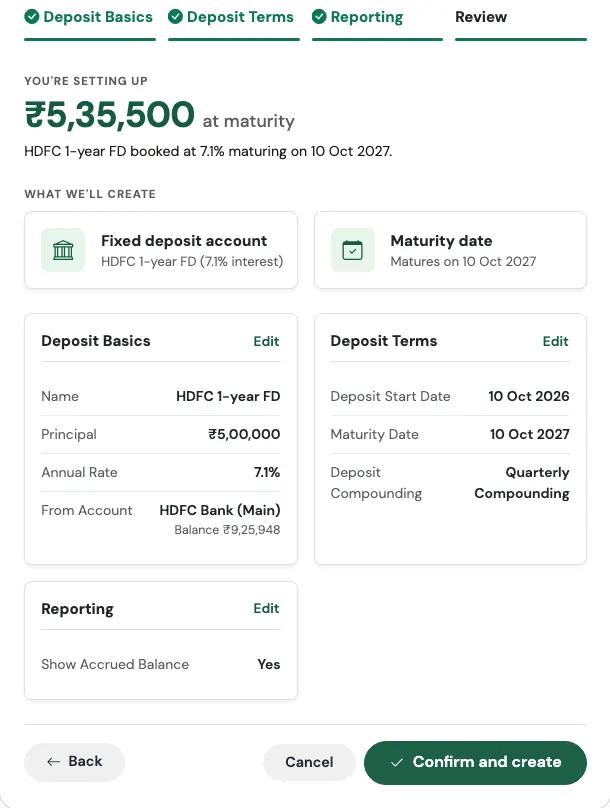{ loading=lazy width="560" }

### What gets created

- A **fixed deposit account** with the rate, dates, and compounding you entered
- A **one-time funding entry**, recorded as a Capital Event of type *Investment Lump Sum*, taking the principal out of the funding account on the start date
- **Maturity tracking**, so you can see what it will be worth, and when

The Review screen shows a quick estimate of the amount you will receive at maturity, such as *₹5,35,000 at maturity*.

!!! example "Real-world use case"
    Sunita books a ₹5,00,000 FD at 7% for one year on 10 October, funded from her savings account, with quarterly compounding.

    She runs **I booked an FD**, fills in the details, leaves **Show accrued balance** on, and turns on **Record maturity income**. On Review she sees *"₹5,35,000 at maturity"*. That figure is a quick estimate. Her bank, which compounds quarterly, will actually pay out a little more, about ₹5,35,930, and the app's accrued balance follows the compounding you chose. Once 10 October next year has passed, the interest is recorded as income the next time she opens the app, so her savings rate for that month reflects it, instead of her having to remember to log it.

### Watch out for

!!! note "Dates are checked for you"
    The form will not accept a maturity date that is on or before the start date, or a closed date that is earlier than the start date. The same checks apply to RDs and to PPF / EPF / NPS, including their end dates.

!!! warning "Why did my bank balance drop?"
    That is the funding entry doing its job. The principal really did leave your savings account on the day you booked the FD. It reappears as an FD balance, so your net worth stays the same.

!!! tip "Why the principal is a Capital Event"
    Putting ₹5,00,000 into an FD is not an expense. Recording it as a Capital Event keeps it out of your monthly spending and your budget, so your Dashboard does not suddenly look like you overspent. See [Capital Events](../09-capital-events/index.md).

---

## I Contribute to PPF / EPF / NPS

> *Yearly or monthly contributions to your retirement scheme.*

### Think of it like boarding a long-distance train

You do not get to your destination in a day. You board once a year, sit down, and the journey takes years. What matters is that you keep boarding. This Flow tracks your boarding, the yearly contribution, and the progress of the journey, the growing balance.

### When to use it

Use it for a Public Provident Fund, Employees' Provident Fund, or National Pension System account where you make a regular contribution. It takes about a minute.

### What you fill in

**Step 1: Scheme Basics**

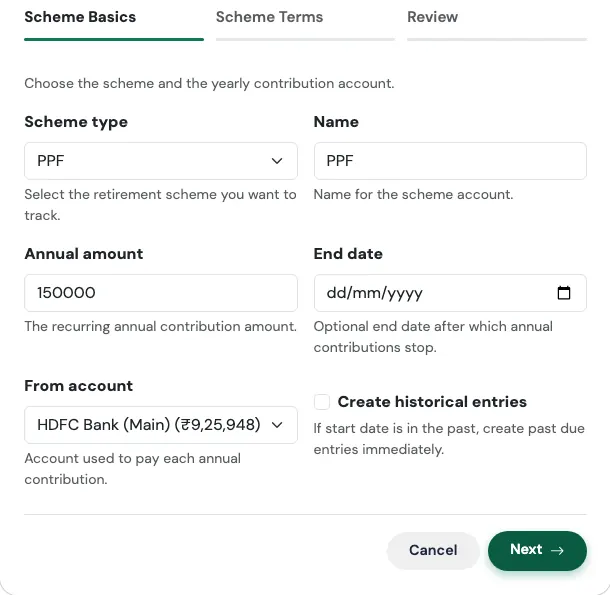{ loading=lazy width="560" }

| Field | What to enter |
|---|---|
| **Scheme type** | PPF, EPF, or NPS. |
| **Name** | A label for the account, such as "SBI PPF". |
| **Annual amount** | The yearly contribution. |
| **End date** | Optional. After this date, contributions stop. |
| **From account** | The account each contribution is paid from. |
| **Create historical entries** | Turn on to add contributions from past years. |

**Step 2: Scheme Terms**

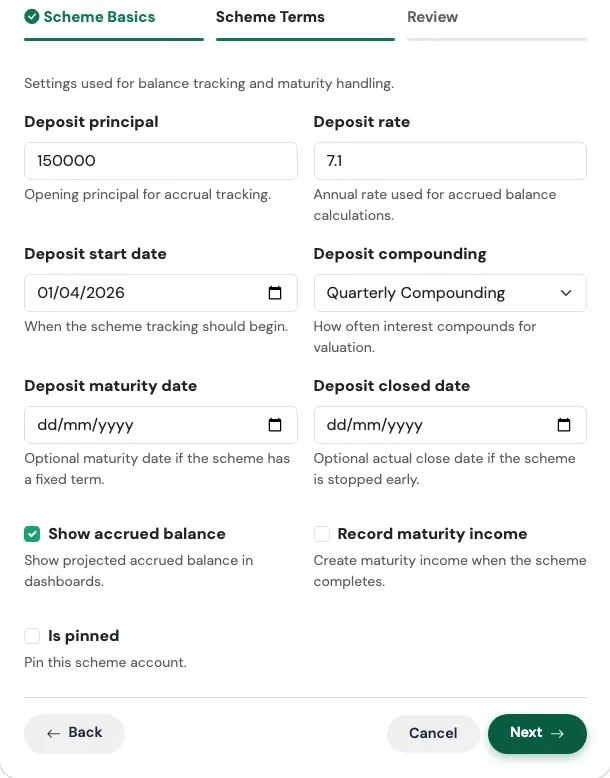{ loading=lazy width="560" }

| Field | What to enter |
|---|---|
| **Deposit principal** | The balance you already have in the scheme. |
| **Deposit rate** | The annual rate used to estimate growth. |
| **Deposit start date** | When tracking begins. |
| **Deposit compounding** | How often interest compounds. |
| **Deposit maturity date** | Optional, for schemes with a fixed term. |
| **Deposit closed date** | Optional, if you stopped early. |
| **Show accrued balance** | Show the projected balance with interest. |
| **Record maturity income** | Create income when the scheme completes. |
| **Is pinned** | Optional. Pins the account to the top. |

**Review and confirm**

The last tab summarises what will be created, with the headline figure at the top, before anything is saved. Check it, then press **Confirm and create**. Use **Edit** on any card to jump back to that step.

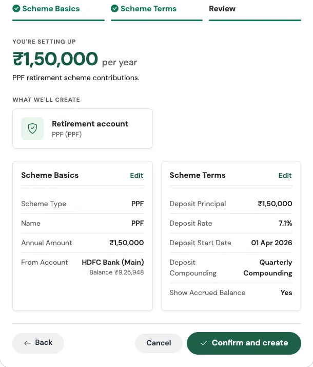{ loading=lazy width="560" }

### What gets created

- A **scheme account** (PPF, EPF, or NPS) holding your balance
- A **recurring yearly transfer** from your bank account into it, labelled as an annual investment contribution

!!! example "Real-world use case"
    Vikram has been putting money into his PPF for six years and has ₹4,20,000 in it. He wants ₹1,50,000 to go in every April from his SBI account.

    He runs **I contribute to PPF / EPF / NPS**, chooses PPF, enters 150000 as the annual amount, and 420000 as the deposit principal with a rate of 7.1%, annual compounding, and 1 April as the start date. Next April, ₹1,50,000 moves on its own from SBI into his PPF account. His net worth does not drop, because it is a transfer, and the PPF balance on his Accounts page keeps growing at the rate he set.

### Watch out for

!!! warning "Enter the balance you already have"
    If you have six years of savings in the scheme and you leave **Deposit principal** at zero, your net worth will look lower than it really is. Enter your current balance, not zero.

!!! warning "EPF is usually deducted from salary"
    If your employer pays your EPF straight from your payslip, the money never passes through your bank account, so a yearly transfer from a bank account will not match reality. For EPF, you may prefer to add the account from the [Accounts](../02-accounts/index.md) page and update its balance from your passbook now and then. This Flow suits PPF and NPS best, where you pay in yourself.

---

## I'm Saving for Something

> *Emergency fund, a trip, a big purchase, set the target.*

### Think of it like a labelled jar on a shelf

A jar marked "Goa trip, December" is much harder to raid than a general pile of money. The label gives each rupee a purpose, and the deadline gives you a pace. This Flow creates that jar in the app, with a target and a date.

### When to use it

Use it for anything you are saving toward: an emergency fund, a holiday, a wedding, a down payment, a new laptop. It takes under a minute.

### What you fill in

**Step 1: Goal Details**

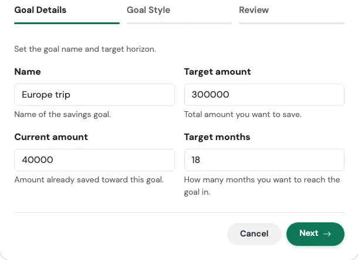{ loading=lazy width="560" }

| Field | What to enter |
|---|---|
| **Name** | What you are saving for. |
| **Target amount** | The total you want to reach. |
| **Current amount** | Optional. What you have already set aside. |
| **Target months** | How many months you give yourself. |

**Step 2: Goal Style** (optional)

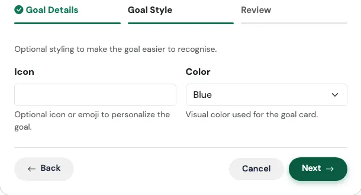{ loading=lazy width="560" }

| Field | What to enter |
|---|---|
| **Icon** | An icon or emoji to recognise the goal at a glance. |
| **Color** | The colour of the goal card: Blue, Green, Red, Yellow, or Light Blue. |

**Review and confirm**

The last tab summarises what will be created, with the headline figure at the top, before anything is saved. Check it, then press **Confirm and create**. Use **Edit** on any card to jump back to that step.

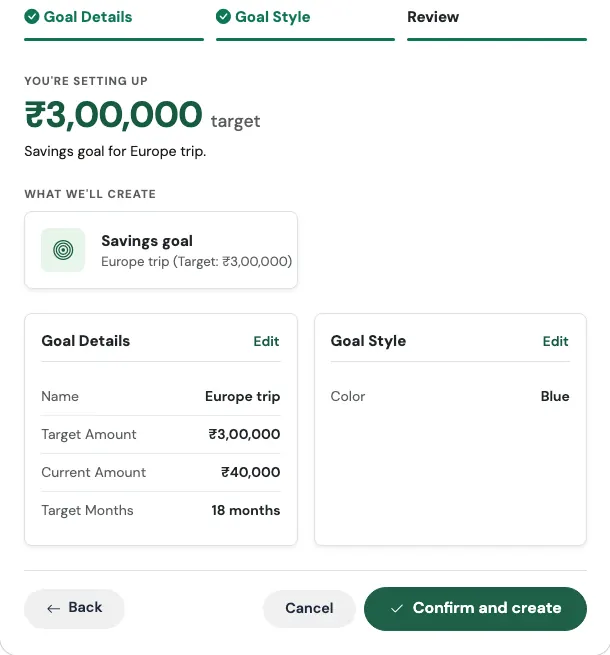{ loading=lazy width="560" }

### What gets created

- A **savings goal** with your target, and a target date that many months from today
- A goal card on your [Savings Goals](../12-goals/index.md) page, where you track progress and add contributions

A quick way to sanity-check your plan: take the target, subtract what you have already saved, and divide by the number of months. That is how much you need to set aside each month.

!!! example "Real-world use case"
    Ananya and her friends are planning a Goa trip 18 months from now. They estimate ₹3,00,000 for her share including flights, and she already has ₹30,000 saved.

    She runs **I'm saving for something**, enters "Goa trip", 300000, 30000 and 18. The maths is simple: ₹2,70,000 still to go over 18 months is ₹15,000 a month. She picks a Blue card with a palm tree icon and confirms. Every month, as she adds money to the goal, the progress bar fills up, and the trip stops being a vague idea and becomes a number with a date.

### Watch out for

!!! tip "A goal is not a separate bank account"
    The goal tracks progress toward a target. It does not move your money anywhere by itself. If you want the money kept apart, put it in a separate account and track the goal against that.

---

## Related Links
- [TMR Flows overview](index.md)
- [Holdings and Mutual Funds](../02-accounts/holdings.md)
- [Accrued vs Invested View](../02-accounts/accrued-vs-invested.md)
- [Transfers](../06-transfers/index.md)
- [Capital Events](../09-capital-events/index.md)
- [Savings Goals](../12-goals/index.md)
