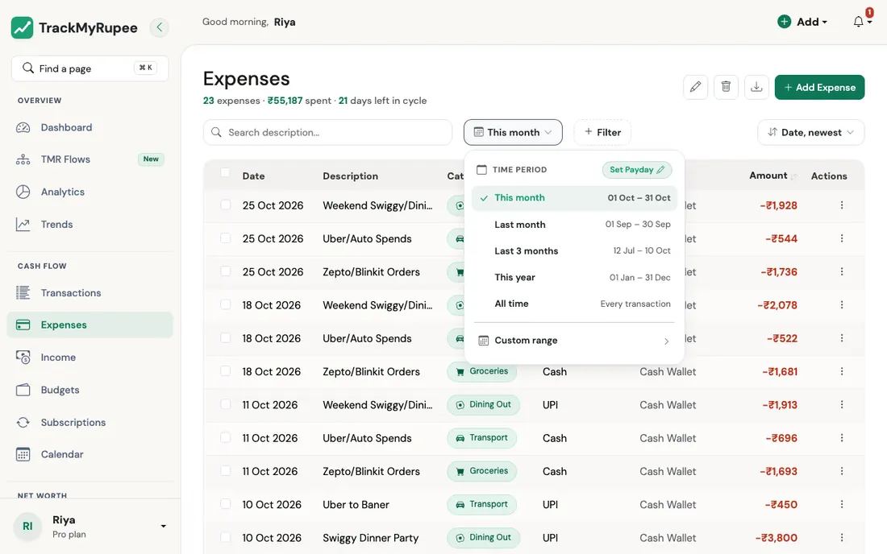
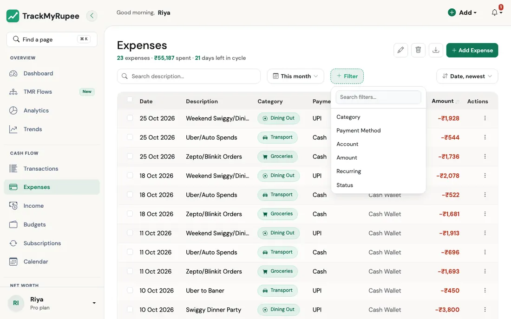
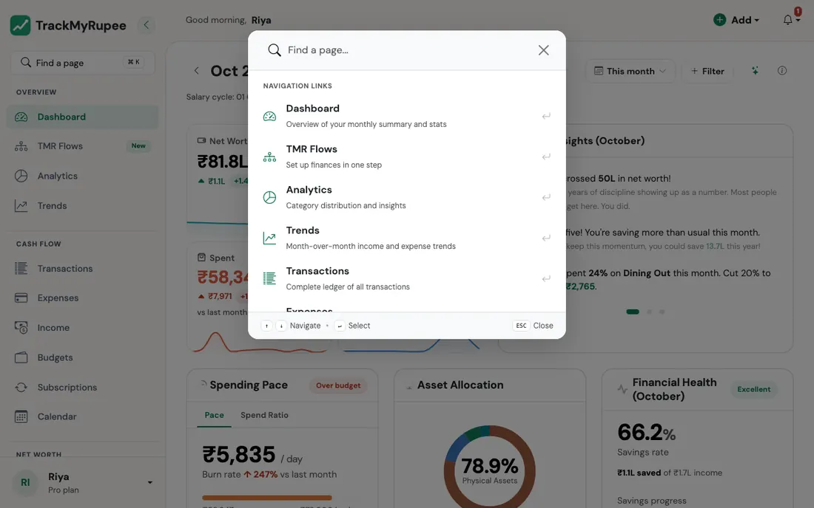

# Searching, Filtering and Sorting

Find the exact transactions you are looking for, and see the totals for just those.

---

## 1. The Filter Bar

Think about how a good kirana store is arranged. Rice is on one shelf, pulses on another, and the labels tell you where to look. You would never walk in and ask the shopkeeper to read out everything he sells. The filter bar is the set of labels for your money.

{ loading=lazy }

Almost every list in TrackMyRupee has the same bar across the top, so once you learn it on one page, you know it on all of them:

| Part | What it does |
|---|---|
| **Search box** | Type a word and the list narrows as you type, for example "swiggy". A small clear button appears so you can empty it in one tap. |
| **Time period** | Chooses which dates you are looking at. |
| **+ Filter** | Adds extra conditions such as category, account, or amount. |
| **Sort** (on the right) | Chooses the order, for example *Date, newest* or *Amount, highest*. |

The bar appears on the Dashboard, Expenses, Income, Transactions, Accounts, Subscriptions, Capital Events, Categories, and on the detail pages for an account and a savings goal.

---

## 2. Choosing a Time Period

Click the time period button (it starts out showing **This month**). A small menu opens with the date range next to each choice:

{ loading=lazy }

- **This month**
- **Last month**
- **Last 3 months**
- **This year**
- **All time**
- **Custom range**: pick a **From** and an **Until** date for anything the shortcuts do not cover

### "This month" follows your pay day

If you have set your salary date, "month" does not mean the 1st to the 31st. It means your **salary cycle**, from one pay day to the day before the next. The menu then shows the cycle's actual dates, along with options to switch to the plain **Calendar Month**, or to look at the **Previous Cycle**.

If you have not set a pay day yet, the menu shows a **Set Payday** shortcut. You can also set it with the [I started a new job](../13-tmr-flows/income-and-bills.md#i-started-a-new-job) Flow.

!!! example "Real-world use case"
    Imran's salary arrives on the 28th. On the 5th of the month, a plain "calendar month" view would say he has barely spent anything, since the month "just started". His salary cycle view tells the truth: he is already a week into spending this paycheque. Switching to Calendar Month is useful only when he wants to compare with a bank statement, which runs on calendar months.

---

## 3. Adding Filters

Click **+ Filter**. A short menu opens, with a small search box at the top if the list is long. Pick a filter, and it appears as a **chip** just below the bar, showing its name and the value, for example **Category: Any**.

{ loading=lazy }

- **Click the chip** to choose which values you want. You can choose more than one.
- Click the small **x** on a chip to remove just that filter.
- Click **Clear all** to remove every filter and start over.

Filters combine. Pick two, and you see only what matches **both**.

### Amount ranges and "No account"

The **Amount** filter offers ranges such as *Under 500*, *500 to 2,000*, *2,000 to 10,000* and *Over 10,000*. They are in your own currency, using the amount converted to it.

On the Expenses, Income and Capital Events pages the **Account** filter also has a **No account** choice. It lists older entries that were saved before every transaction needed an account. Open one and choose an account so it counts towards that account's balance.

### What you can filter by, page by page

| Page | Filters available |
|---|---|
| **Dashboard** | Category, Payment Method, Account |
| **Expenses** | Category, Payment Method, Account, Amount, Recurring |
| **Income** | Source Type, Income Group, Account, Amount |
| **Transactions** | Transaction Type, Account, Amount |
| **Subscriptions** | Category, Billing Cycle, Status, Account, Type |
| **Capital Events** | Event Type, Account, Amount |
| **Accounts** | Account Type, Status, Pinned |
| **Categories** | Budget |
| **A single account** | Transaction Type, Category, Amount |
| **A savings goal** | Account, Amount |

!!! tip "The Income Group filter"
    Income can be grouped as **Earned** (salary, freelance, business), **Passive** (investment returns, rent), or **One-off** (rewards, refunds, other). It is a quick way to see how much of your income you worked for, and how much simply arrived.

---

## 4. Sorting

Use the sort control on the right of the bar. The choices depend on the page. Lists with dates offer *Date, newest* and *Date, oldest*, plus *Amount, highest* and *Amount, lowest*. Accounts can be sorted by balance or name, Categories by name or monthly limit, and Subscriptions by how soon they renew.

On the Expenses, Income and Transactions tables you can also click the **Amount** column heading to flip between highest first and lowest first.

---

## 5. The Totals Change With Your Filters

The line under the page title is not decoration. On Expenses, for example, it reads something like *"9 expenses, ₹27,380 spent, 21 days left in cycle"*, and it updates to match whatever you have filtered. Filter to one category and the count and total are for that category alone.

The page address also updates as you filter. That means you can **bookmark** a filtered view, such as "Food, last 3 months", and come back to it later.

!!! example "Real-world use case"
    Meera suspects she is spending too much on food delivery. She opens Expenses, sets the time period to **Last 3 months**, adds a **Category** filter set to Food, and a **Payment Method** filter set to UPI. The line under the title now shows how many Food payments she made by UPI and the total. It is more than she guessed. She bookmarks the page, so next month she can check whether the number has dropped.

---

## 6. Finding a Page Quickly

At the top of the desktop sidebar is a box that says **Find a page**, with a shortcut hint next to it. Press **Cmd + K** on a Mac, or **Ctrl + K** on Windows or Linux, from anywhere in the app.

{ loading=lazy }

A small window opens. Start typing, such as "export" or "categories", and the list of pages narrows. Use the **up and down arrow keys** to move through the list, **Enter** to open the highlighted page, and **Esc** to close the window.

It is like asking the station announcer which platform your train is on, instead of walking along every platform to read the boards.

---

## Related Links
- [Adding Expenses](../03-transactions-expenses/index.md)
- [Adding Income](../04-transactions-income/index.md)
- [Budgets](../07-budgets/index.md)
- [Getting Started](../01-getting-started/index.md)
